# 第 1~4 章 嵌入式 Linux C 应用编程 — 复习笔记

> **教材**：《I.MX6U 嵌入式 Linux C 应用编程指南》（正点原子）  
> **范围**：第 1 章 应用编程概念 · 第 2 章 文件 I/O 基础 · 第 3 章 深入文件 I/O · 第 4 章 标准 I/O 库  
> **配图目录**：[`../images/`](./../images/)（命名规则 `fig-章-节-图.png`，如 `fig-3-2-1.png` = 图 3.2.1）

---

## 全书总目录

| 章 | 主题 | 核心内容 |
|----|------|----------|
| **1** | 应用编程概念 | 系统调用、库函数、glibc、main、开发环境 |
| **2** | 文件 I/O 基础 | fd、open/read/write/close/lseek、flags、mode |
| **3** | 深入文件 I/O | inode、errno、空洞文件、O_APPEND、dup、竞态、fcntl、截断 |
| **4** | 标准 I/O 库 | FILE*、fopen、fread、缓冲、fsync、O_DIRECT、fileno |

---

# 第 1 章 应用编程概念 — 复习笔记

> **教材**：《I.MX6U 嵌入式 Linux C 应用编程指南》（正点原子）  
> **配图**：`../images/fig-1-x-x-x.png`

---

## 本章目录

1.1 系统调用 · 1.2 库函数 · 1.3 标准 C 库 glibc · 1.4 main 函数 · 1.5 开发环境

---

## 章节导读

本章是应用编程的**总览**：弄清系统调用、库函数、裸机/驱动/应用三层分工，以及后续学习用的 Ubuntu + vscode + gcc 环境。掌握本章是后续文件 I/O 的前提。

---

## 1.1 系统调用

### 核心定义

| 概念 | 说明 |
|------|------|
| **系统调用** | Linux **内核**提供给应用层的 API，是应用进入内核的**入口** |
| **作用** | 打开/读写/关闭文件、控制硬件等，由内核代应用执行 |
| **关系** | 应用 → 调用系统调用 API → 内核提供服务/资源 |


### 三种编程方式对比（LED 点亮为例）

| 对比项 | 裸机编程 | Linux 驱动编程 | Linux 应用编程 |
|--------|----------|----------------|----------------|
| 运行环境 | 无 OS，直接跑硬件 | **内核态**，内核加载驱动 | **用户态**，有 OS 支持 |
| 硬件操作 | 应用代码里直接写 | 驱动里实现 open/write 等 | **不直接**操作硬件 |
| 与用户逻辑 | 同文件、无隔离 | 驱动与用户程序**分离编译** | 只写用户逻辑 |
| 典型接口 | 寄存器/GPIO 函数 | `file_operations`、platform_driver | `open`/`write`/`close` 等系统调用 |
| 举例 | `led_on()` 与 main 同工程 | 驱动 `led_write` 解析用户数据 | `write(fd, &data, …)` 控制 LED |

**用户态 vs 内核态**：应用程序运行在用户态，内核与驱动运行在内核态。

#### 示例代码 1.1.1 LED 裸机程序

```c
static void led_on(void)
{
    /* 点亮 LED 硬件操作代码 */
}

static void led_off(void)
{
    /* 熄灭 LED 硬件操作代码 */
}

int main(void)
{
    for (;;) {
        led_on();
        delay();
        led_off();
        delay();
    }
}
```

*特点：硬件代码与用户逻辑在同一源文件，无 OS，俗称「裸跑」。*

#### 示例代码 1.1.2 Linux LED 驱动程序（框架示意）

```c
#include <linux/module.h>
#include <linux/platform_device.h>
#include <linux/of_gpio.h>
#include <linux/delay.h>
#include <linux/cdev.h>
#include <linux/uaccess.h>

static void led_on(void)  { /* 硬件操作 */ }
static void led_off(void) { /* 硬件操作 */ }

static ssize_t led_write(struct file *filp, const char __user *buf,
                         size_t size, loff_t *offt)
{
    int flag;
    if (copy_from_user(&flag, buf, size))
        return -EFAULT;
    if (flag)
        led_on();
    else
        led_off();
    return 0;
}

static struct file_operations led_fops = {
    .owner   = THIS_MODULE,
    .open    = led_open,
    .write   = led_write,
    .release = led_release,
};

/* platform_driver 注册、probe/remove、of_match_table … */
module_platform_driver(led_driver);
```

*要点：`write` 写入 **0 熄灭、非 0 点亮**；应用通过系统调用间接控制硬件。*

#### 示例代码 1.1.3 Linux LED 应用程序

```c
#include <sys/types.h>
#include <sys/stat.h>
#include <fcntl.h>
#include <unistd.h>

int main(int argc, char **argv)
{
    int fd, data;

    fd = open("/dev/led", O_WRONLY);
    if (0 > fd)
        return -1;

    for (;;) {
        data = 1;
        write(fd, &data, sizeof(data));
        sleep(1);
        data = 0;
        write(fd, &data, sizeof(data));
        sleep(1);
    }
    close(fd);
    return 0;
}
```

*应用与驱动**单独编译**；应用只关心业务逻辑，硬件细节在驱动中。*

---

## 1.2 库函数

### 系统调用 vs 库函数（易混重点）

| 对比项 | 系统调用 | C 库函数（如 glibc） |
|--------|----------|----------------------|
| 层次 | **内核**提供 | **应用层** C 库 |
| 运行 | 用户态 → **陷入内核态** | 多在用户空间完成 |
| 缓存 | **无**用户态缓存 | 常有缓存，**性能通常更好** |
| 可移植性 | 各 OS 接口差异大 | C 库跨平台接口较统一 |
| 关系 | — | 很多库函数**封装**系统调用（如 `fopen`→`open`） |
| 例外 | — | 部分库函数**不**调系统调用（`strlen`、`memcpy` 等） |

**封装示例**：

- `fopen` 内部调用 `open`
- `fread` 利用 `read`
- `fwrite` 利用 `write`

**使用建议**：从用户角度都当作 C 函数即可；开发时知道调用的是系统调用还是库函数，便于查 man 手册（`man 2` vs `man 3`）。

---

## 1.3 标准 C 语言函数库（glibc）

| 项目 | 说明 |
|------|------|
| Linux 标准 C 库 | **GNU C Library（glibc）** |
| 官网 | http://www.gnu.org/software/libc/ |
| 安装位置 | 通常 `/lib`，动态库名 `libc.so.6`（软链接） |
| 源码 | 官网 Sources / git / ftp 获取 |

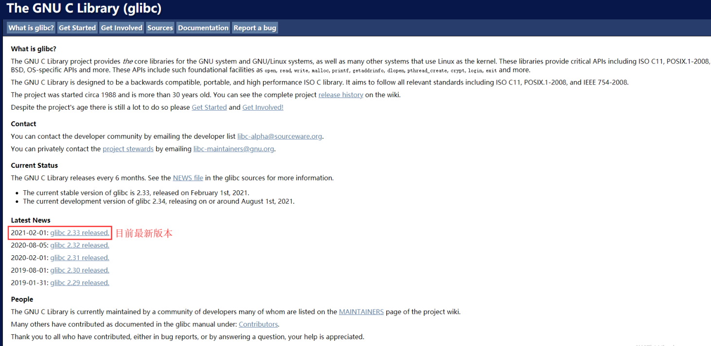  


### 查看 glibc 版本

1. 查看软链接：`/lib/x86_64-linux-gnu/libc.so.6` → 如 `libc-2.23.so` → 版本 **2.23**
2. 直接运行共享库：`./libc.so.6` 会打印版本信息

  
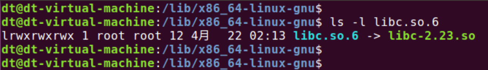

---

## 1.4 main 函数

应用程序**入口**，两种常见写法：

#### 示例代码 1.4.1 无传参

```c
int main(void)
{
    /* 代码 */
}
```

#### 示例代码 1.4.2 有传参

```c
int main(int argc, char **argv)
{
    /* 代码 */
}
```

| 参数 | 含义 |
|------|------|
| `argc` | 参数个数（**含**程序路径/名） |
| `argv[]` | 参数字符串数组 |

示例：`./hello 112233` → `argc=2`，`argv[0]="./hello"`，`argv[1]="112233"`。

---

## 1.5 本书使用的开发环境

### 三篇内容与工具链

| 篇章 | 运行平台 | 开发方式 | 工程管理 |
|------|----------|----------|----------|
| **入门篇**（含第 1~4 章） | PC Ubuntu | **vscode + gcc** | 单 `.c` 文件 |
| **提高篇** | I.MX6U 开发板 | **vscode + ARM 交叉 gcc** | 单 `.c` 文件 |
| **进阶篇** | 开发板/项目 | **cmake + vscode** | 多文件工程 |

**推荐系统**：Ubuntu **16.04** 或 **14.04**（教材验证版本）；亦可用 CentOS、Redhat 等。

**IDE 选择**：

- 本书主用 **vscode**（语法高亮、补全、终端集成）
- 亦可用 Eclipse（1.5 小节有安装步骤，**非必须**）
- 甚至 **vi** 均可——重点是学应用编程，不是学 IDE

**gcc / 交叉编译 / cmake**：详见驱动开发指南对应章节。

### Ubuntu 下安装 Eclipse（可选，步骤摘要）

教材 1.5 节含完整图文（图 1.5.1~1.5.28），核心步骤：

| 步骤 | 操作 |
|------|------|
| ① 下载 Eclipse | [eclipse.org](https://www.eclipse.org/) → **Eclipse IDE for C/C++ Developers**（Linux x86_64） |
| ② 下载 JDK | Oracle **Java SE 8**，Linux x64 压缩包 |
| ③ 安装 Eclipse | `sudo tar -xzf eclipse-cpp-*.tar.gz -C /opt/` |
| ④ 桌面快捷方式 | 桌面创建 `eclipse.desktop`，`Exec=/opt/eclipse/eclipse`，`chmod u+x` |
| ⑤ 安装 JDK | 解压到 `/opt/`，在 `~/.bashrc` 配置 `JDK_HOME`、`PATH` |
| ⑥ 关联 | Eclipse 目录下建 `jre`，软链接到 `$JDK_HOME/bin` |
| ⑦ 验证 | `java -version`；启动 Eclipse 创建 C 工程测试 |

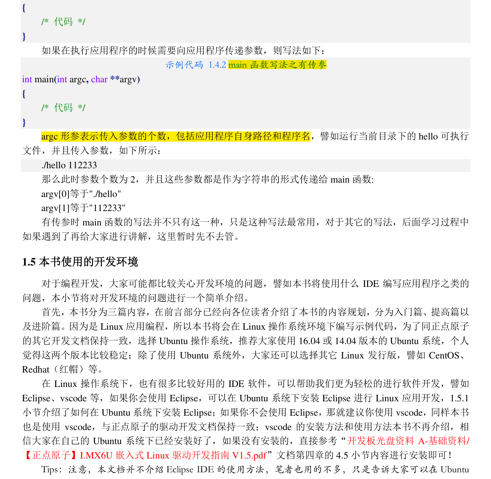  
  
  
  
  
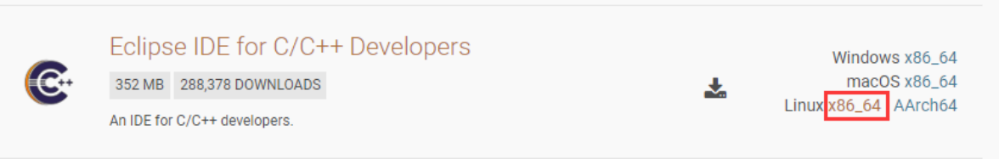  
  
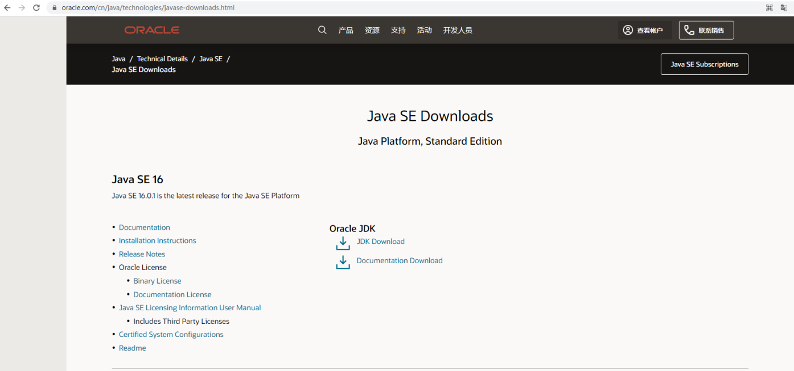  
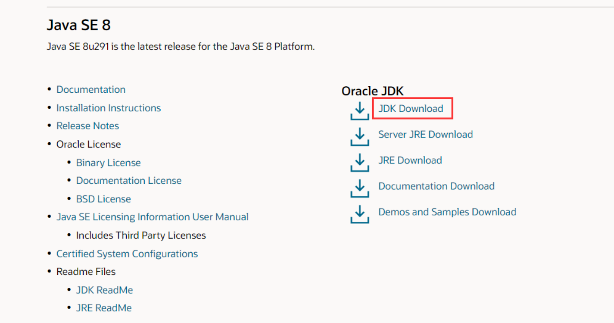  
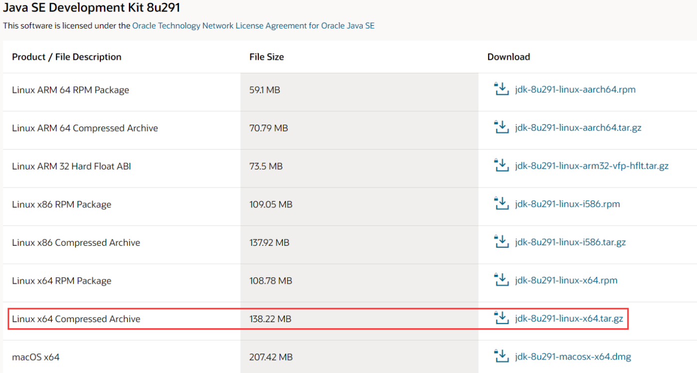  
  
  
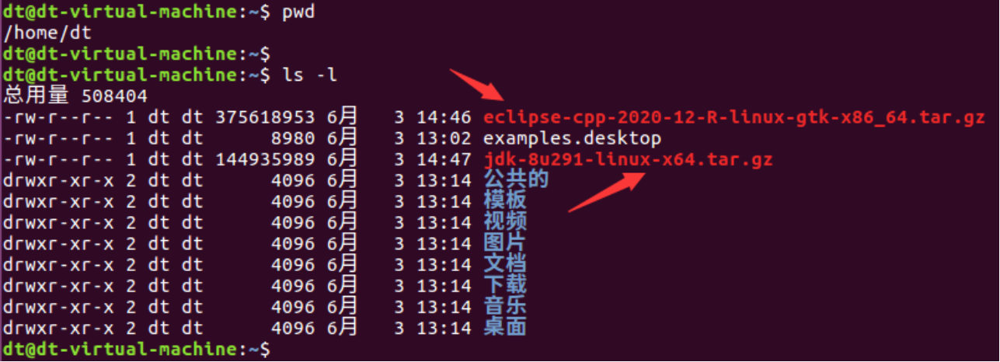  
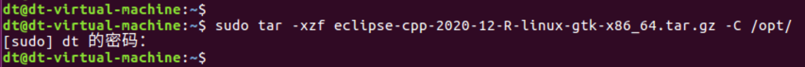  
  
  
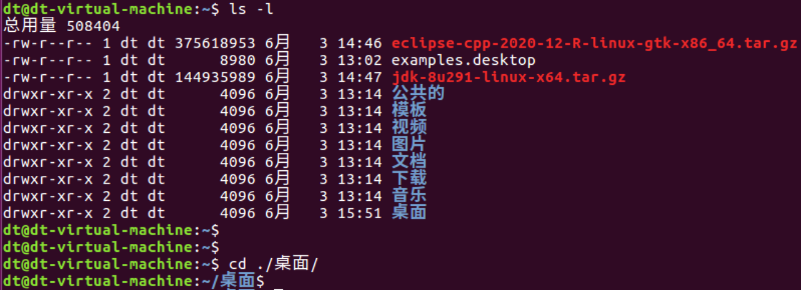  
  
  
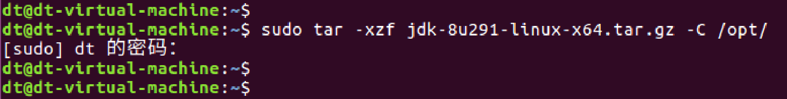  
  
  
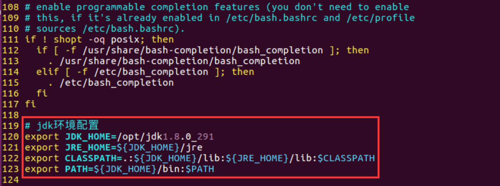  
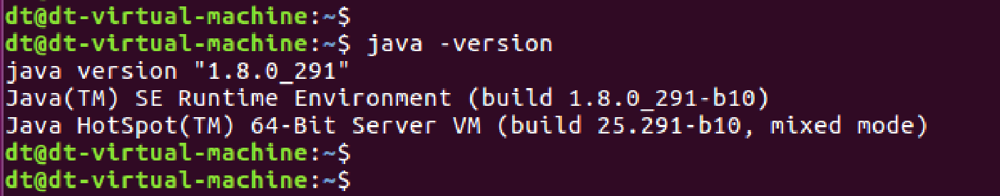  
  
  
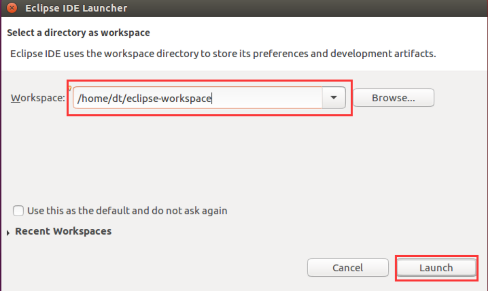  


**eclipse.desktop 模板**：

```ini
[Desktop Entry]
Encoding=UTF-8
Name=Eclipse
Comment=Eclipse
Exec=/opt/eclipse/eclipse
Icon=/opt/eclipse/icon.xpm
Terminal=false
StartupNotify=true
Type=Application
Categories=Application;Development;
```

**JDK 环境变量（~/.bashrc 末尾）**：

```bash
export JDK_HOME=/opt/jdk1.8.0_291
export JRE_HOME=${JDK_HOME}/jre
export CLASSPATH=.:${JDK_HOME}/lib:${JRE_HOME}/lib:$CLASSPATH
export PATH=${JDK_HOME}/bin:$PATH
```

---

## 第 1 章易混点速查

| # | 易混 | 区分要点 |
|---|------|----------|
| 1 | 系统调用 vs 库函数 | 内核 API vs 用户态 C 库；后者常封装前者 |
| 2 | 裸机 vs 驱动 vs 应用 | 同文件裸跑 / 内核驱动 / 用户态调 API |
| 3 | 用户态 vs 内核态 | 应用 vs 内核+驱动 |
| 4 | `man 2` vs `man 3` | 系统调用 vs 库函数手册 |
| 5 | 应用 vs 驱动开发 | 不同方向、不同职责，需协作 |

---

# 第 2 章 文件 I/O 基础 — 复习笔记

> **配图**：`../images/fig-2-x-x-x.png`

---

## 本章目录

2.1 示例 · 2.2 文件描述符 · 2.3 open · 2.4 write · 2.5 read · 2.6 close · 2.7 lseek · 2.8 练习与 vscode

---

## 章节导读

Linux **一切皆文件**。本章介绍最基础的文件 I/O 系统调用：`open` / `read` / `write` / `close` / `lseek`，以及文件描述符、open 标志与权限 mode。是第 3 章（深入文件 I/O）和第 4 章（标准 I/O）的基础。

---

## 2.1 一个简单的文件 I/O 示例

通用 I/O 模型：**打开 → 读写 → 关闭**。

#### 示例代码 2.1.1 文件拷贝（1KB）

```c
#include <sys/types.h>
#include <sys/stat.h>
#include <fcntl.h>
#include <unistd.h>

int main(void)
{
    char buff[1024];
    int fd1, fd2;
    int ret;

    fd1 = open("./src_file", O_RDONLY);
    if (-1 == fd1)
        return fd1;

    fd2 = open("./dest_file", O_WRONLY);
    if (-1 == fd2) {
        ret = fd2;
        goto out1;
    }

    ret = read(fd1, buff, sizeof(buff));
    if (-1 == ret)
        goto out2;

    ret = write(fd2, buff, sizeof(buff));
    if (-1 == ret)
        goto out2;

    ret = 0;
out2:
    close(fd2);
out1:
    close(fd1);
    return ret;
}
```

*流程：只读打开源文件 → 只写打开目标文件 → read 1KB → write 1KB → close。*

---

## 2.2 文件描述符

| 要点 | 说明 |
|------|------|
| 类型 | `open` 成功返回 **非负整数** fd |
| 作用 | 进程内索引，内核用 fd 定位已打开文件 |
| 分配 | 从 **最小未使用** fd 开始；关闭后 fd 可复用 |
| 默认占用 | **0** stdin、**1** stdout、**2** stderr → 故普通 open 常从 **3** 起 |
| 进程限制 | `ulimit -n` 查看，默认常 **1024**（0~1023） |
| 设备文件 | 硬件也对应设备文件，open 设备得 fd |


**Tips**：fd 是**有限资源**，不用时应 `close` 释放。

---

## 2.3 open 打开文件

```c
#include <sys/types.h>
#include <sys/stat.h>
#include <fcntl.h>

int open(const char *pathname, int flags);
int open(const char *pathname, int flags, mode_t mode);
```

- 查手册：`man 2 open`（**man 2** = 系统调用）

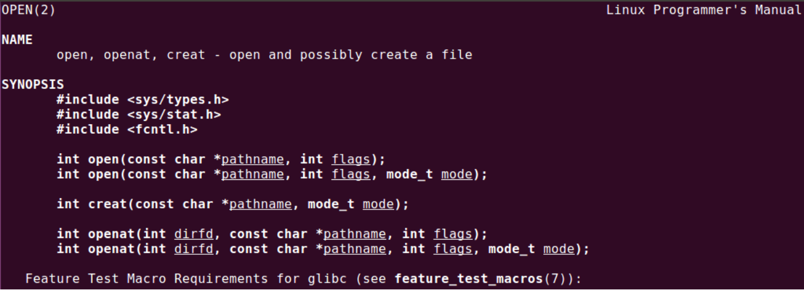

### 参数说明

| 参数 | 说明 |
|------|------|
| `pathname` | 路径（相对/绝对）；若为符号链接，默认**解引用** |
| `flags` | 访问模式 + 其它标志，可 `\|` 组合 |
| `mode` | 仅当 flags 含 **`O_CREAT` 或 `O_TMPFILE`** 时有效 |

### flags 常用标志（表 2.3.1）

| 标志 | 用途 | 说明 |
|------|------|------|
| `O_RDONLY` | 只读 | 三选一：只读/只写/读写 |
| `O_WRONLY` | 只写 | |
| `O_RDWR` | 读写 | |
| `O_CREAT` | 不存在则创建 | 需第 3 参数 mode |
| `O_EXCL` | 与 O_CREAT 合用 | 已存在则失败；**原子**「测+建」 |
| `O_DIRECTORY` | 必须是目录 | 否则失败 |
| `O_NOFOLLOW` | 符号链接 | **不解引用**，直接错误 |

*教材还提到 O_APPEND、O_TRUNC 等，第 3 章详讲。*

**flags 与文件权限**：打开方式须与进程对该文件的权限一致，否则 open 失败（如只有读权限却 `O_WRONLY`）。

### mode 权限（表 2.3.2 宏）


| 位段 | 含义 |
|------|------|
| U（owner） | 文件所属者 rwx |
| G（group） | 同组用户 rwx |
| O（other） | 其他用户 rwx |
| 每 bit | r=4, w=2, x=1 |

常用宏：`S_IRUSR` `S_IWUSR` `S_IXUSR` `S_IRWXU` … `S_IRGRP` … `S_IROTH` …

**示例**：`S_IRWXU | S_IRGRP | S_IROTH` → owner 全权限，组/其他只读。

### open 使用示例

```c
/* (1) 只读打开已存在文件 */
int fd = open("./app.c", O_RDONLY);

/* (2) 读写打开 */
int fd = open("./app.c", O_RDWR);

/* (3) 符号链接不解引用 */
int fd = open("/home/dengtao/hello", O_RDWR | O_NOFOLLOW);

/* (4) 不存在则创建，owner rwx，组/其他 r */
int fd = open("/home/dengtao/hello", O_RDWR | O_CREAT,
              S_IRWXU | S_IRGRP | S_IROTH);
```

**返回值**：成功 → fd（≥0）；失败 → **-1**。

---

## 2.4 write 写文件

```c
#include <unistd.h>
ssize_t write(int fd, const void *buf, size_t count);
```

| 参数/返回 | 说明 |
|-----------|------|
| `fd` | 已打开且可写的代码的文件描述符 |
| `buf` | 数据源缓冲区 |
| `count` | 期望写入字节数 |
| 成功 | 返回**实际写入字节数**（可能 < count，如磁盘满） |
| 失败 | -1 |

**当前偏移**：普通文件读写从**当前偏移**开始；默认 0（文件头）；每次 read/write 后偏移自动后移。

---

## 2.5 read 读文件

```c
#include <unistd.h>
ssize_t read(int fd, void *buf, size_t count);
```

| 返回 | 含义 |
|------|------|
| >0 | 实际读到的字节数（可能 < count） |
| 0 | **文件末尾**（EOF） |
| -1 | 错误 |

*例：剩 30 字节却要求读 100 → 返回 30；再 read → 返回 0。*

---

## 2.6 close 关闭文件

```c
#include <unistd.h>
int close(int fd);
```

| 返回 | 含义 |
|------|------|
| 0 | 成功 |
| -1 | 失败 |

- 进程退出时内核会**自动**关闭其打开的文件，但显式 `close` 是良好习惯。
- fd 有限，及时释放。

---

## 2.7 lseek 读写偏移

```c
#include <sys/types.h>
#include <unistd.h>
off_t lseek(int fd, off_t offset, int whence);
```

| whence | 含义 |
|--------|------|
| `SEEK_SET` | 相对**文件头**，偏移 = offset |
| `SEEK_CUR` | 相对**当前位置**，±offset |
| `SEEK_END` | 相对**文件尾**，±offset |

**成功返回**：从文件头算起的**当前偏移**；失败 -1。

```c
lseek(fd, 0, SEEK_SET);    /* 移到开头 */
lseek(fd, 0, SEEK_END);    /* 移到末尾 */
lseek(fd, 100, SEEK_SET);  /* 偏移 100 字节 */
lseek(fd, 0, SEEK_CUR);    /* 获取当前偏移 */
```

---

## 2.8 练习与 vscode 开发流程

### 四个编程实战（建议独立完成）

| # | 任务摘要 |
|---|----------|
| (1) | 只读 `src_file`；`O_CREAT\|O_EXCL` 创建 `dest_file`（owner rwx，组/他 r）；从 src **偏移 500** 读 1KB 写到 dest **开头** |
| (2) | 用 open 判断 `test_file` 是否存在并打印结果 |
| (3) | 新建 `new_file`，前 1KB 写 0x00，后 1KB 写 0xFF |
| (4) | 用 `lseek` 计算 `test_file` 大小并打印 |

### vscode + gcc 流程

1. 创建工作目录（如 `~/vscode_ws`）
2. vscode：**文件 → 打开文件夹**
3. 建子目录 `1_chapter`，创建 `testApp_1.c`

  
  
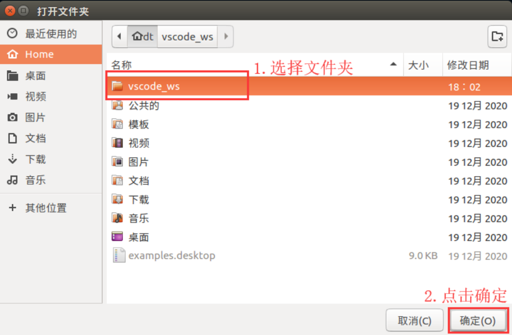  
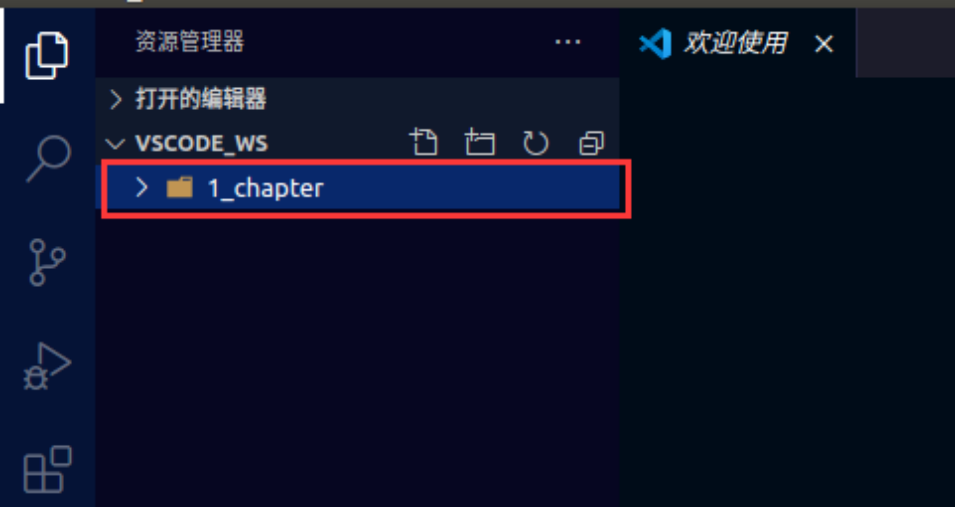  
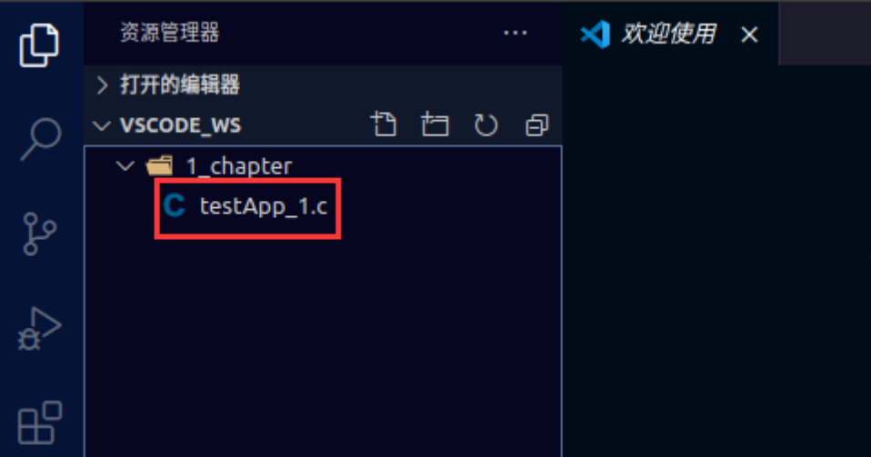

#### 示例代码 2.8.1 编程实战例子 1（教材完整）

```c
#include <sys/types.h>
#include <sys/stat.h>
#include <fcntl.h>
#include <unistd.h>
#include <stdio.h>

int main(void)
{
    char buffer[1024];
    int fd1, fd2;
    int ret;

    fd1 = open("./src_file", O_RDONLY);
    if (-1 == fd1) {
        printf("Error: open src_file failed!\n");
        return -1;
    }

    fd2 = open("./dest_file", O_WRONLY | O_CREAT | O_EXCL,
               S_IRWXU | S_IRGRP | S_IROTH);
    if (-1 == fd2) {
        printf("Error: open dest_file failed!\n");
        ret = -1;
        goto err1;
    }

    ret = lseek(fd1, 500, SEEK_SET);
    if (-1 == ret)
        goto err2;

    ret = read(fd1, buffer, sizeof(buffer));
    if (-1 == ret) {
        printf("Error: read src_file filed!\n");
        goto err2;
    }

    ret = lseek(fd2, 0, SEEK_SET);
    if (-1 == ret)
        goto err2;

    ret = write(fd2, buffer, sizeof(buffer));
    if (-1 == ret) {
        printf("Error: write dest_file failed!\n");
        goto err2;
    }

    printf("OK: test successful\n");
    ret = 0;
err2:
    close(fd2);
err1:
    close(fd1);
    return ret;
}
```

**编译运行**：

```bash
gcc -o testApp_1 testApp_1.c
./testApp_1
```

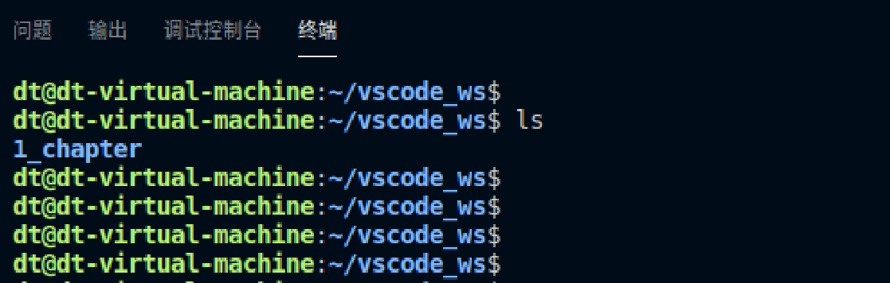  
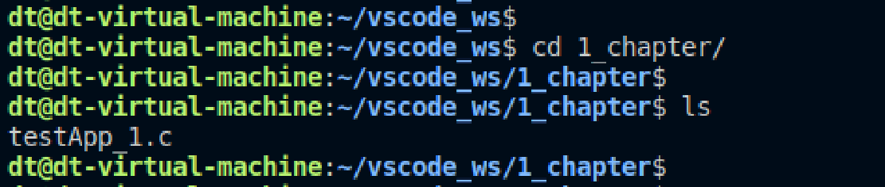  
  
  
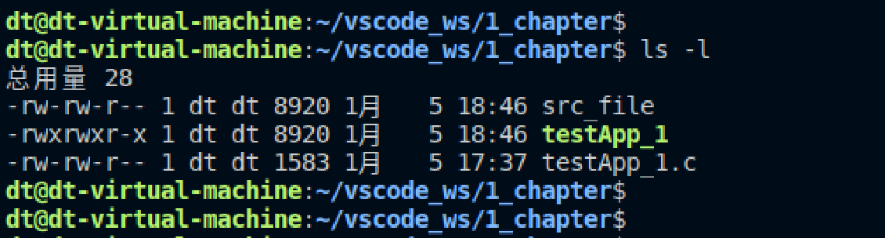

### 函数返回值惯例（全书通用）

| 惯例 | 说明 |
|------|------|
| 成功 | 常返回 **0** 或非负 fd/字节数 |
| 失败 | 常返回 **-1**（或负值） |
| 判断 | `if (-1 == fd)` 或 `if (0 > ret)` |

*并非所有函数都如此，以 man 手册为准。*

---

## 第 2 章易混点速查

| # | 易混 | 区分要点 |
|---|------|----------|
| 1 | fd 从 0 还是从 3 开始 | 0~2 被标准流占用；新 open 一般从 3 起 |
| 2 | `open` 两参数 vs 三参数 | 有 `O_CREAT`/`O_TMPFILE` 才要 mode |
| 3 | `O_RDONLY` 等 vs 文件权限 rwx | 打开方式须与进程权限匹配 |
| 4 | read 返回 0 vs -1 | 0=EOF，-1=错误 |
| 5 | write 返回 < count | 不一定是错误（如磁盘满） |
| 6 | lseek 返回 vs fseek 返回 | lseek 返回**新偏移**；fseek 成功返回 **0**（第 4 章） |
| 7 | `O_EXCL` 单独用 | 须与 `O_CREAT` 合用才有「存在则失败」语义 |

---

---

# 第 3 章 深入探究文件 I/O — 复习笔记

> **配图**：`../images/fig-3-x-x-x.png`

---

## 本章目录

3.1 Linux 如何管理文件 · 3.2 errno · 3.3 退出 · 3.4 空洞文件 · 3.5 O_TRUNC/O_APPEND  
3.6 多次 open · 3.7 dup/dup2 · 3.8 文件共享 · 3.9 原子与竞态 · 3.10 fcntl/ioctl · 3.11 截断

---

## 3.1 Linux 系统如何管理文件

### 3.1.1 静态文件、inode、块

| 概念 | 说明 |
|------|------|
| 静态文件 | 未打开时存放在磁盘块设备上 |
| 扇区 Sector | 常 512B，磁盘最小存储单位 |
| 块 Block | 常 4KB（8 扇区），文件 I/O 常用单位 |
| inode 区 | 格式化后存放 inode table |
| 数据区 | 存放文件真实内容 |

**inode 记录**：大小、所有者、权限、时间戳、类型、数据 block 位置等。**文件名不在 inode 中**（目录项维护「名 → inode 号」）。

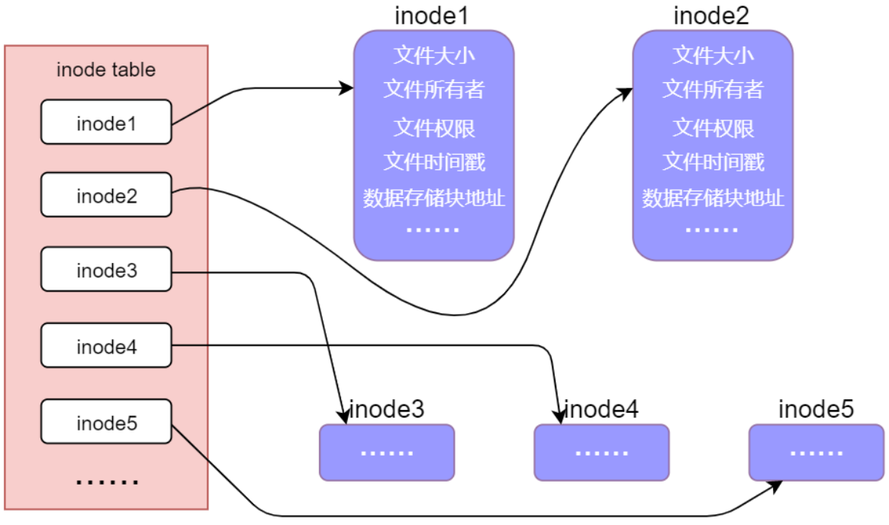

| 命令 | 作用 |
|------|------|
| `ls -i` | 查看 inode 编号（图 3.1.2） |
| `stat` | 查看 inode 详情（图 3.1.3） |

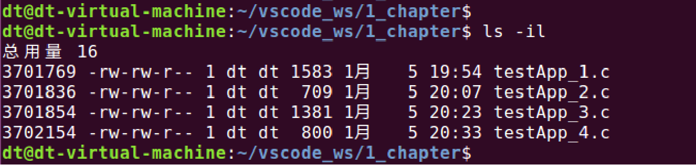 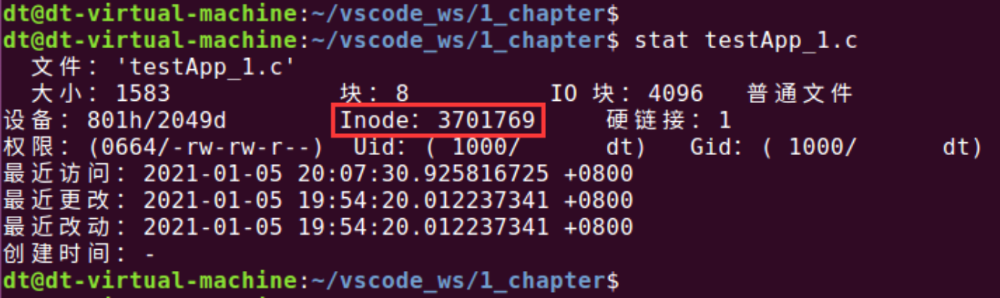

**快速格式化**：只删 inode 表，数据区仍在 → 数据可恢复（图 3.1.4）。


**路径打开文件三步**：① 文件名 → inode 号 → ② 查 inode table → ③ 按 block 指针读数据。

### 3.1.2 动态文件

`open` 后内核在内存维护**动态文件**（内核缓冲），读写主要对内存操作，再由内核异步写回磁盘。

| 现象 | 原因 |
|------|------|
| 开大文件慢 | 载入内核缓冲 |
| 未保存断电丢数据 | 改动可能仅在内存 |
| 用内存做缓存 | 块设备按块改写慢；内存随机访问快 |

### 3.1.3 PCB、fd 表、文件表、inode

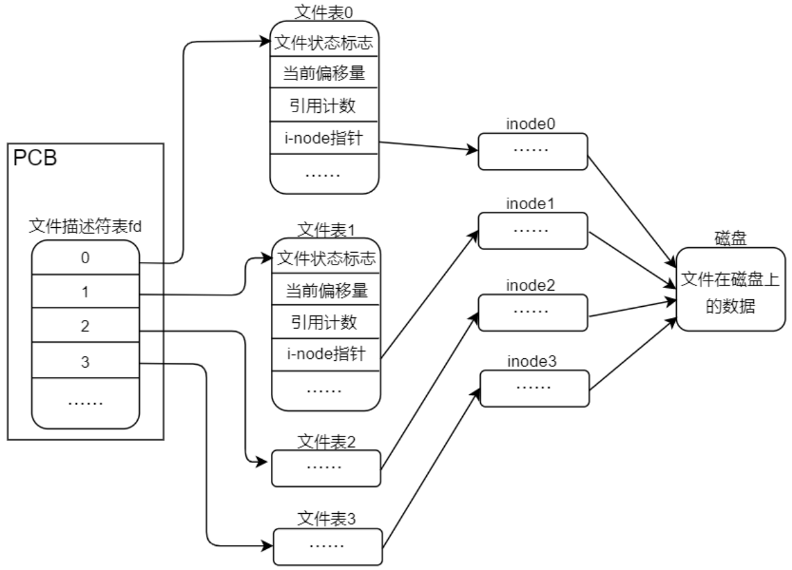

- **fd**：进程内索引，非文件本体  
- **文件表**：每 fd 一条，含标志、**引用计数**、**当前偏移**、inode 指针  
- **inode**：标识磁盘上同一文件

---

## 3.2 返回错误处理与 errno

- 失败常返回 `-1`，原因在 **`errno`**（`#include <errno.h>`，每进程一份，**后错覆盖前错**）。
- 是否设置 errno：查 **`man 2 函数名`** 的 RETURN VALUE。

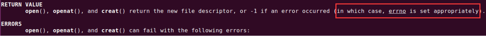

### strerror 与 perror 对比

| 对比项 | `strerror(errno)` | `perror("前缀")` |
|--------|-------------------|------------------|
| 头文件 | `<string.h>` | `<stdio.h>` |
| 输出方式 | 返回字符串，需自己 `printf` | 直接打印到 stderr |
| 典型用法 | 日志、自定义格式 | **调试首选** |

#### 示例代码 3.2.1 strerror

```c
#include <sys/types.h>
#include <sys/stat.h>
#include <fcntl.h>
#include <unistd.h>
#include <stdio.h>
#include <errno.h>
#include <string.h>

int main(void)
{
    int fd;

    fd = open("./test_file", O_RDONLY);
    if (-1 == fd) {
        printf("Error: %s\n", strerror(errno));
        return -1;
    }
    close(fd);
    return 0;
}
```

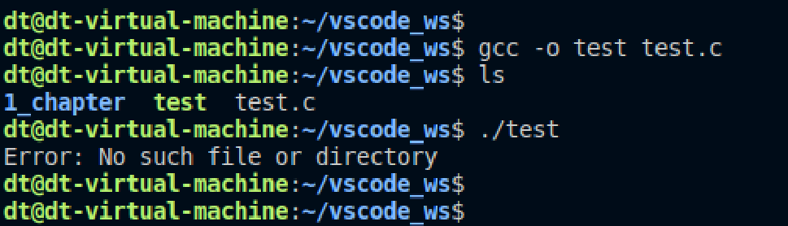

#### 示例代码 3.2.2 perror

```c
    fd = open("./test_file", O_RDONLY);
    if (-1 == fd) {
        perror("open error");
        return -1;
    }
```

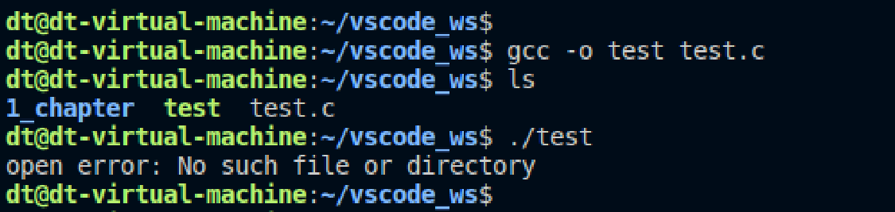

---

## 3.3 exit、_exit、_Exit

### 四种正常退出方式对比

| 方式 | 类型 | 是否刷新 stdio | 是否调 C 库清理 | 典型场景 |
|------|------|:--------------:|:---------------:|----------|
| `return`（main） | — | 会（经 exit 路径） | 会 | main 正常结束 |
| `exit(status)` | C 库 | **会** | **会** | 应用层推荐 |
| `_exit(status)` | 系统调用 | 否 | 否 | 子进程、已知不需刷缓冲 |
| `_Exit(status)` | 系统调用 | 否 | 否 | 与 `_exit` 等价 |

#### 示例代码 3.3.1 _exit

```c
#include <sys/types.h>
#include <sys/stat.h>
#include <fcntl.h>
#include <unistd.h>
#include <stdio.h>

int main(void)
{
    int fd;

    fd = open("./test_file", O_RDONLY);
    if (-1 == fd) {
        perror("open error");
        _exit(-1);
    }
    close(fd);
    _exit(0);
}
```

---

## 3.4 空洞文件（Sparse File）

- `lseek` 可把偏移设到**超过当前文件长度**；中间未写区域 = **空洞**。
- **逻辑大小**（`ls`）含空洞；**物理占用**（`du`）不含，写入后才分配块。

```
[0~4095] 空洞  →  [4096~8191] 实际数据  →  ls≈8K, du≈4K
```

#### 示例代码 3.4.1

```c
#include <sys/types.h>
#include <sys/stat.h>
#include <fcntl.h>
#include <unistd.h>
#include <stdio.h>
#include <string.h>
#include <stdlib.h>

int main(void)
{
    int fd, ret;
    char buffer[1024];
    int i;

    fd = open("./hole_file", O_WRONLY | O_CREAT | O_EXCL,
             S_IRUSR | S_IWUSR | S_IRGRP | S_IROTH);
    if (-1 == fd) {
        perror("open error");
        exit(-1);
    }

    ret = lseek(fd, 4096, SEEK_SET);
    if (-1 == ret) {
        perror("lseek error");
        goto err;
    }

    memset(buffer, 0xFF, sizeof(buffer));
    for (i = 0; i < 4; i++) {
        ret = write(fd, buffer, sizeof(buffer));
        if (-1 == ret) {
            perror("write error");
            goto err;
        }
    }

    ret = 0;
err:
    close(fd);
    exit(ret);
}
```

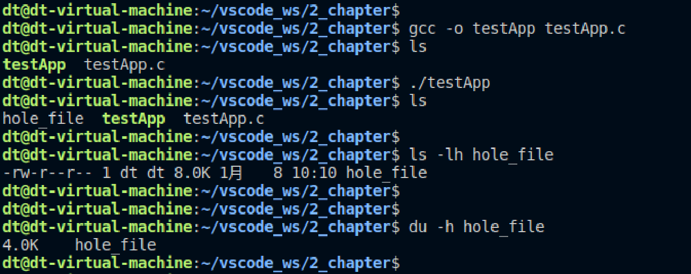

> **思考题**：`read` 空洞区读到什么？需自行实验（常为 `0x00`）。

---

## 3.5 O_APPEND 与 O_TRUNC

### O_TRUNC 与「截断函数」的区别（易混）

| 对比项 | `O_TRUNC`（open 标志） | `truncate` / `ftruncate`（见 3.11） |
|--------|------------------------|-------------------------------------|
| 时机 | **打开瞬间**清空 | 文件已打开后/用路径随时截断 |
| 接口 | `open(..., O_TRUNC)` | `truncate(path,len)` / `ftruncate(fd,len)` |
| 长度 | 变为 0 | 可设为任意 `length` |

#### 示例代码 3.5.1 O_TRUNC

```c
#include <sys/types.h>
#include <sys/stat.h>
#include <fcntl.h>
#include <unistd.h>
#include <stdio.h>
#include <stdlib.h>

int main(void)
{
    int fd;

    fd = open("./test_file", O_WRONLY | O_TRUNC);
    if (-1 == fd) {
        perror("open error");
        exit(-1);
    }
    close(fd);
    exit(0);
}
```

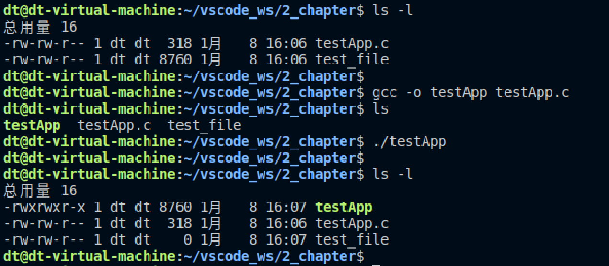  
*打开前 8760 字节 → 仅 open+close 后变为 0*

### O_APPEND 要点

| 对比项 | 写操作 | 读操作 |
|--------|--------|--------|
| 偏移 | 每次 `write` 前自动移到**文件尾** | **不影响**，默认仍可从文件头读 |
| `lseek` | **不能**改变写偏移（write 仍落末尾） | 可正常 `lseek` 后 read |

#### 示例代码 3.5.2 O_APPEND

```c
#include <sys/types.h>
#include <sys/stat.h>
#include <fcntl.h>
#include <unistd.h>
#include <stdio.h>
#include <stdlib.h>
#include <string.h>

int main(void)
{
    char buffer[16];
    int fd, ret;

    fd = open("./test_file", O_RDWR | O_APPEND);
    if (-1 == fd) {
        perror("open error");
        exit(-1);
    }

    memset(buffer, 0x55, sizeof(buffer));
    ret = write(fd, buffer, 4);
    if (-1 == ret) {
        perror("write error");
        goto err;
    }

    memset(buffer, 0x00, sizeof(buffer));
    ret = lseek(fd, -4, SEEK_END);
    if (-1 == ret) {
        perror("lseek error");
        goto err;
    }

    ret = read(fd, buffer, 4);
    if (-1 == ret) {
        perror("read error");
        goto err;
    }

    printf("0x%x 0x%x 0x%x 0x%x\n",
           buffer[0], buffer[1], buffer[2], buffer[3]);

    ret = 0;
err:
    close(fd);
    exit(ret);
}
```

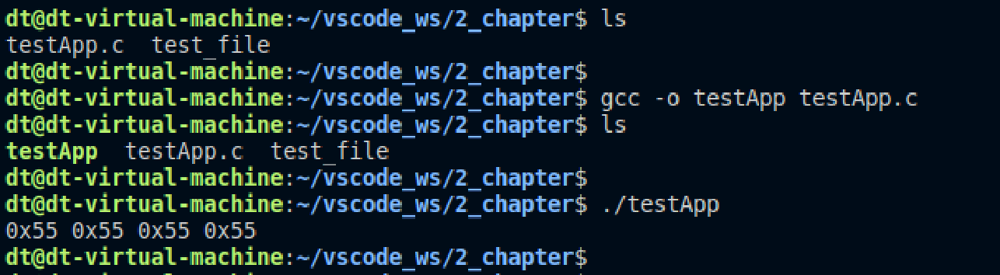

**思考题**：`O_APPEND | O_TRUNC` → 先截断为 0，再追加写。

---

## 3.6 多次打开同一文件

### 核心结论对照

| 对比项 | 多次 `open` 同一文件 | `dup` / `dup2`（见 3.7） |
|--------|----------------------|-------------------------|
| fd 个数 | 多个 | 多个 |
| 文件表 | **多个**（各一条） | **同一表项** |
| 读写偏移 | **相互独立** | **共享** |
| 动态文件（内存） | **一份** | **一份** |
| 默认写方式 | 分别写（易覆盖） | 接续写 |
| 接续写办法 | 两 fd 都加 `O_APPEND` | 直接交替 write |

#### 示例代码 3.6.1 三个 fd

```c
#include <sys/types.h>
#include <sys/stat.h>
#include <fcntl.h>
#include <unistd.h>
#include <stdio.h>
#include <stdlib.h>

int main(void)
{
    int fd1, fd2, fd3;
    int ret;

    fd1 = open("./test_file", O_RDWR);
    if (-1 == fd1) { perror("open error"); exit(-1); }

    fd2 = open("./test_file", O_RDWR);
    if (-1 == fd2) { perror("open error"); ret = -1; goto err1; }

    fd3 = open("./test_file", O_RDWR);
    if (-1 == fd3) { perror("open error"); ret = -1; goto err2; }

    printf("%d %d %d\n", fd1, fd2, fd3);

    close(fd3);
    ret = 0;
err2:
    close(fd2);
err1:
    close(fd1);
    exit(ret);
}
```

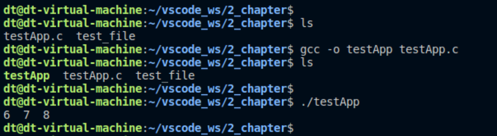

#### 示例代码 3.6.2 共享动态文件

```c
#include <sys/types.h>
#include <sys/stat.h>
#include <fcntl.h>
#include <unistd.h>
#include <stdio.h>
#include <stdlib.h>
#include <string.h>

int main(void)
{
    char buffer[4];
    int fd1, fd2, ret;

    fd1 = open("./test_file", O_RDWR | O_CREAT | O_EXCL,
             S_IRUSR | S_IWUSR | S_IRGRP | S_IROTH);
    if (-1 == fd1) { perror("open error"); exit(-1); }

    fd2 = open("./test_file", O_RDWR);
    if (-1 == fd2) { perror("open error"); ret = -1; goto err1; }

    buffer[0] = 0x11; buffer[1] = 0x22;
    buffer[2] = 0x33; buffer[3] = 0x44;
    write(fd1, buffer, 4);

    lseek(fd2, 0, SEEK_SET);
    memset(buffer, 0x00, sizeof(buffer));
    read(fd2, buffer, 4);
    printf("0x%x 0x%x 0x%x 0x%x\n",
           buffer[0], buffer[1], buffer[2], buffer[3]);

    ret = 0;
err1:
    close(fd2);
    close(fd1);
    exit(ret);
}
```

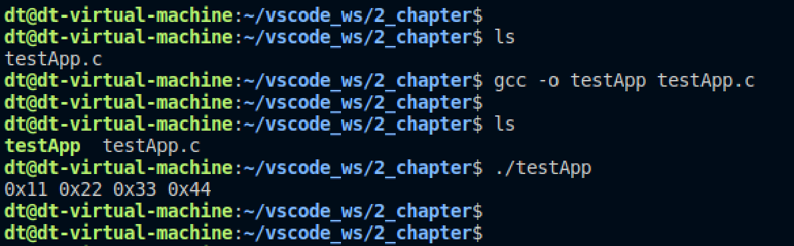

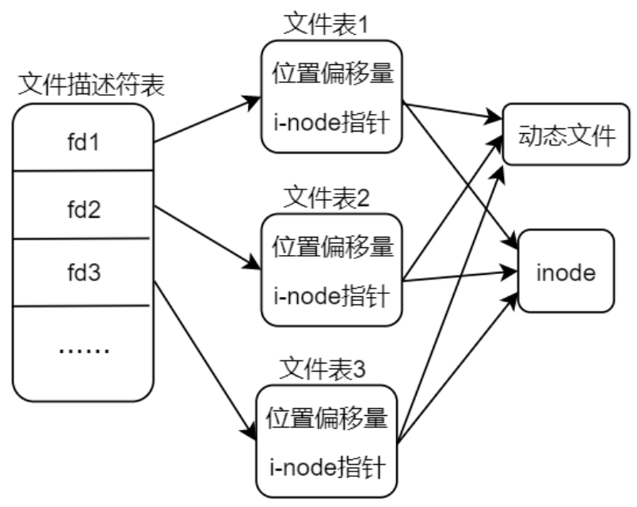

#### 示例代码 3.6.3 分别写（无 O_APPEND）

```c
/* 与 3.6.2 相同 open 方式；buffer1=0x11..44, buffer2=0xAA..DD */
for (i = 0; i < 4; i++) {
    write(fd1, buffer1, sizeof(buffer1));
    write(fd2, buffer2, sizeof(buffer2));
}
lseek(fd1, 0, SEEK_SET);
for (i = 0; i < 8; i++) {
    read(fd1, buffer1, sizeof(buffer1));
    printf("%x%x%x%x", buffer1[0], buffer1[1], buffer1[2], buffer1[3]);
}
/* 输出 aabbccdd... */
```

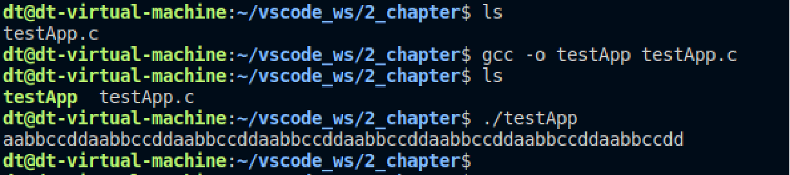

#### 示例代码 3.6.4 接续写（双 O_APPEND）

```c
fd1 = open("./test_file", O_RDWR | O_CREAT | O_EXCL | O_APPEND,
          S_IRUSR | S_IWUSR | S_IRGRP | S_IROTH);
fd2 = open("./test_file", O_RDWR | O_APPEND);
/* 循环写同上 → 读出 11223344aabbccdd... */
```

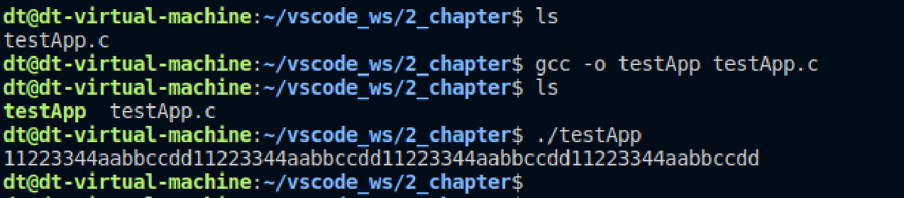

- **跨进程**：多进程 `open` 同一文件 → 共享一份动态文件，**偏移仍独立**。
- **引用计数**：文件表记录；所有 fd `close` 且计数为 0 才释放动态缓存。

---

## 3.7 复制文件描述符 dup / dup2

```c
#include <unistd.h>
int dup(int oldfd);
int dup2(int oldfd, int newfd);
```

### dup / dup2 / fcntl(F_DUPFD) 对比

| 对比项 | `dup` | `dup2` | `fcntl(fd, F_DUPFD, min)` |
|--------|-------|--------|---------------------------|
| 新 fd 编号 | 系统分配最小可用 | **调用者指定** `newfd` | ≥ `min` 的最小可用 |
| 共享文件表 | 是 | 是 | 是 |
| 共享偏移 | 是 | 是 | 是 |
| 失败时 | -1 | -1（newfd 非法或占用） | -1 |

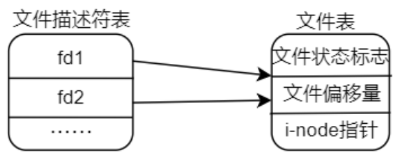

#### 示例代码 3.7.1 dup 接续写

```c
/* 与 3.6.3 结构相同，区别：fd2 = dup(fd1); 无 O_APPEND 也能接续写 */
fd1 = open("./test_file", O_RDWR | O_CREAT | O_EXCL, 0664);
fd2 = dup(fd1);
/* 循环 write(fd1,buffer1); write(fd2,buffer2); 再 read 验证 */
```

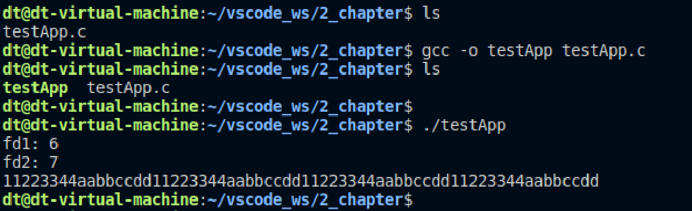

#### 示例代码 3.7.2 dup2 指定 fd

```c
fd2 = dup2(fd1, 100);   /* 新 fd 必为 100（若未被占用） */
printf("fd1: %d\nfd2: %d\n", fd1, fd2);
```

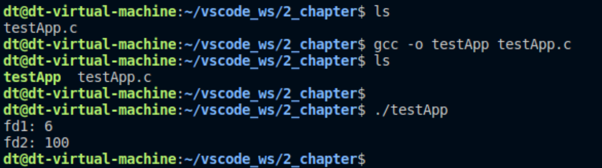

---

## 3.8 文件共享

**定义**：同一 **inode** 被多个读写体同时 I/O。

| 实现方式 | 共享偏移？ | 示意图 |
|----------|:----------:|--------|
| 同进程多次 open | 否 | 图 3.8.1 |
| 不同进程 open | 否 | 图 3.8.2 |
| dup / dup2 | **是** | 图 3.8.3 |

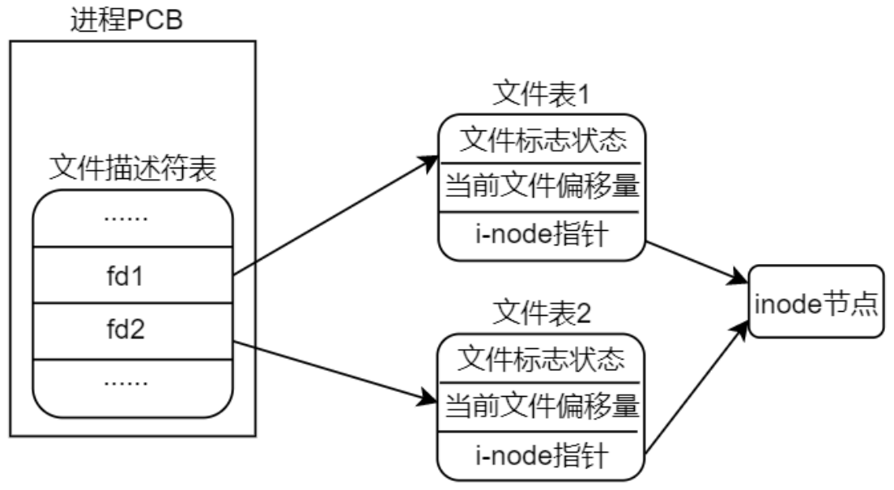  
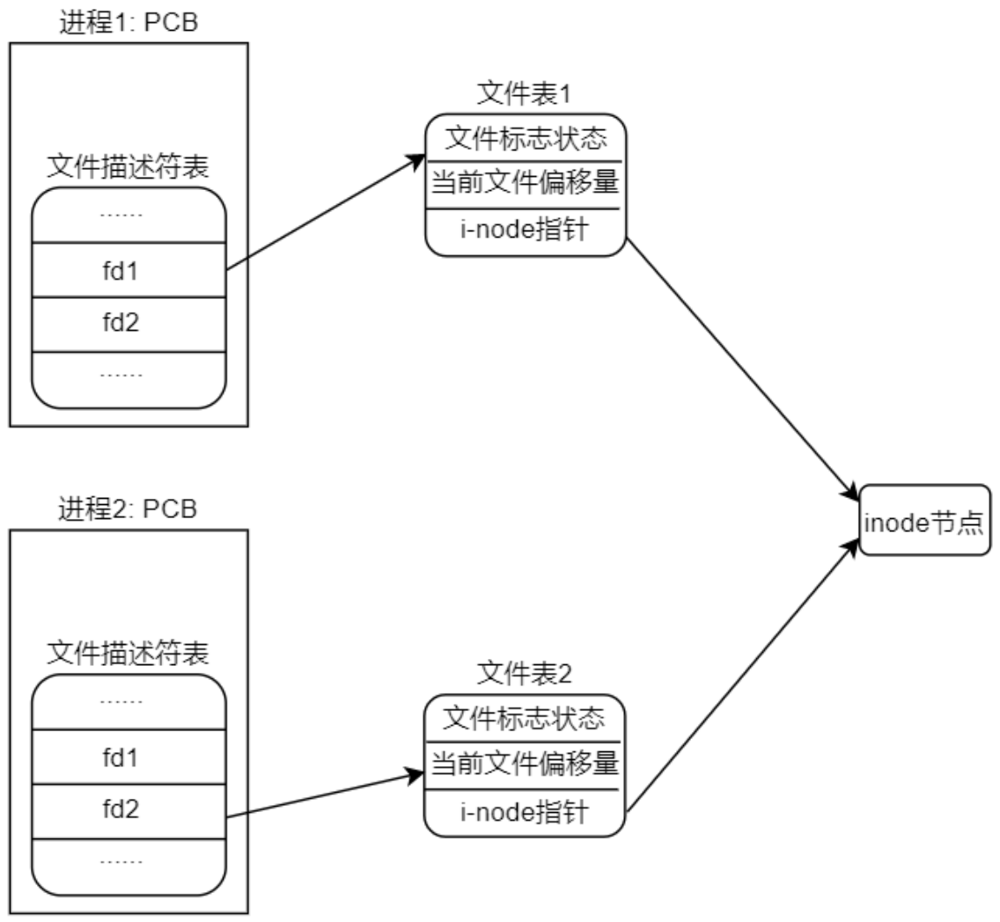  
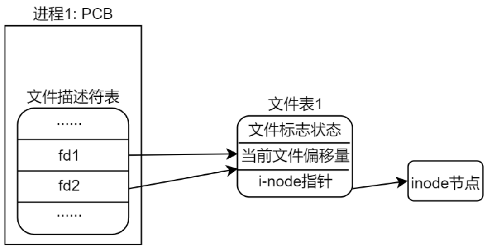

---

## 3.9 原子操作与竞争冒险

### 竞争冒险

「`lseek` 到末尾」+「`write`」是两步，多进程交错 → 覆盖（图 3.9.1）。

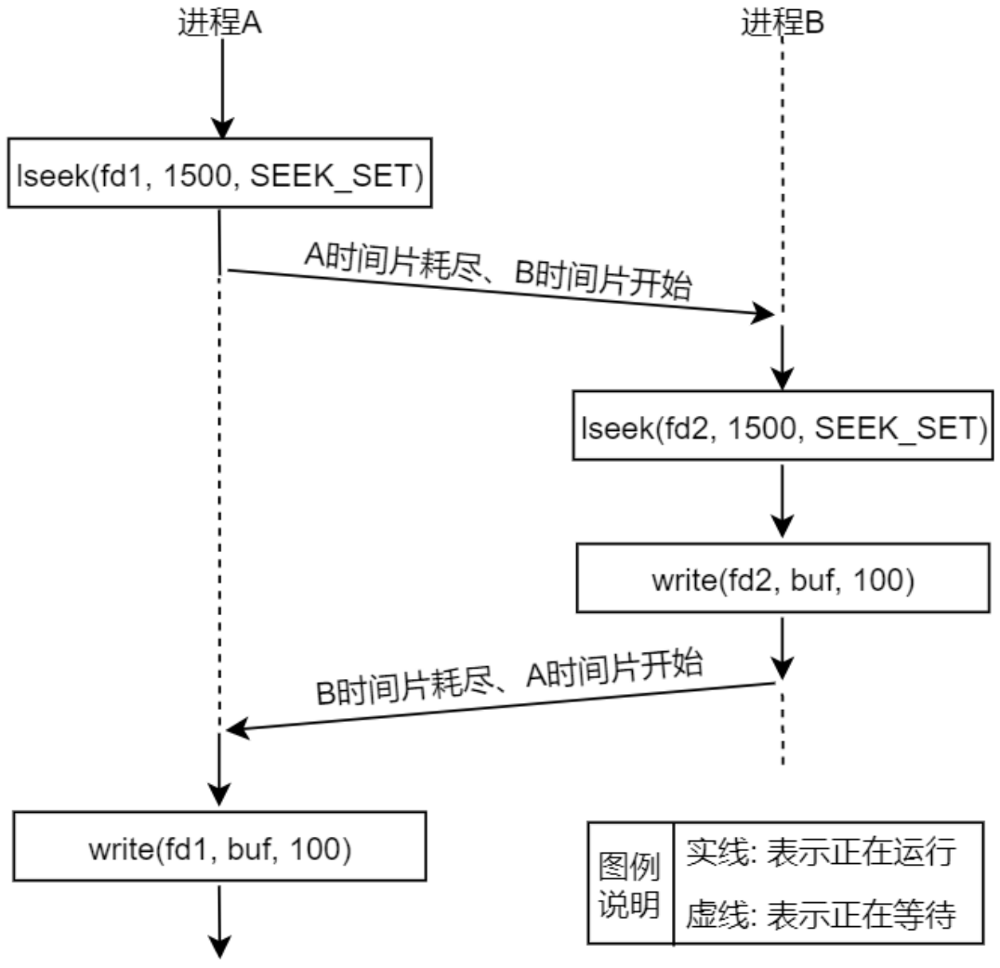

### 三种原子化手段对比

| 手段 | 原子了什么 | 与 read+lseek 对比 |
|------|------------|-------------------|
| `O_APPEND` | write 内「移到尾+写」 | 仅影响写 |
| `pread`/`pwrite` | 带 offset 的一次读写 | **不改变** fd 当前偏移 |
| `O_CREAT\|O_EXCL` | 不存在才创建 | 防双创建 |

### pread / pwrite 与 lseek+read/write

| 对比项 | `read` + `lseek` | `pread` |
|--------|------------------|---------|
| 步骤 | 两步，可被打断 | 一步 |
| 调用后当前偏移 | **会改变** | **不改变**（教材验证仍为 0） |

#### 示例代码 3.9.1 pread

```c
#include <sys/types.h>
#include <sys/stat.h>
#include <fcntl.h>
#include <unistd.h>
#include <stdio.h>
#include <stdlib.h>

int main(void)
{
    unsigned char buffer[100];
    int fd, ret;

    fd = open("./test_file", O_RDWR);
    if (-1 == fd) {
        perror("open error");
        exit(-1);
    }

    ret = pread(fd, buffer, sizeof(buffer), 1024);
    if (-1 == ret) {
        perror("pread error");
        goto err;
    }

    ret = lseek(fd, 0, SEEK_CUR);
    if (-1 == ret) {
        perror("lseek error");
        goto err;
    }
    printf("Current Offset: %d\n", ret);

    ret = 0;
err:
    close(fd);
    exit(ret);
}
```

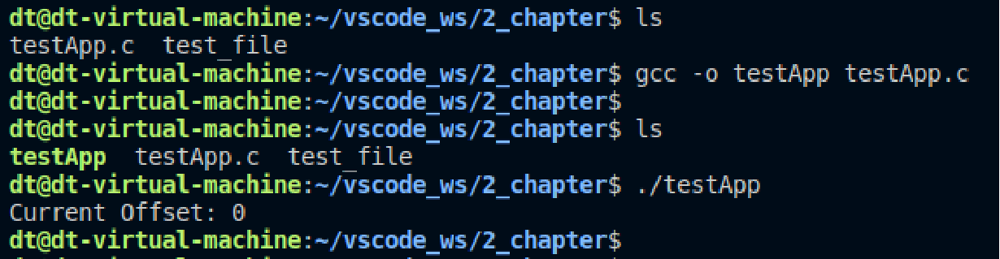  
*打印 Current Offset: 0*

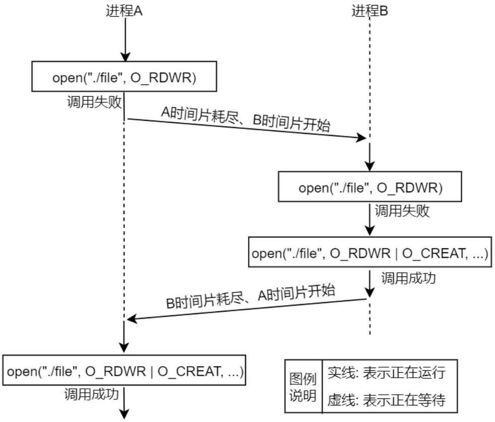

正确创建：`open(path, O_RDWR | O_CREAT | O_EXCL, mode)`。

---

## 3.10 fcntl 与 ioctl

```c
#include <fcntl.h>
int fcntl(int fd, int cmd, ...);
```

| cmd | 作用 |
|-----|------|
| `F_DUPFD` | 复制 fd，第三参为最小新 fd |
| `F_GETFD` / `F_SETFD` | 描述符标志（如 FD_CLOEXEC） |
| `F_GETFL` / `F_SETFL` | 文件状态标志（如事后加 `O_APPEND`） |

**F_SETFL 限制**：只能改 `O_APPEND、O_NONBLOCK、O_DIRECT` 等；**不能**改 `O_RDONLY` 或 `O_CREAT/O_TRUNC`。

#### 示例代码 3.10.1 F_DUPFD

```c
fd1 = open("./test_file", O_RDONLY);
fd2 = fcntl(fd1, F_DUPFD, 0);
printf("fd1: %d\nfd2: %d\n", fd1, fd2);
```

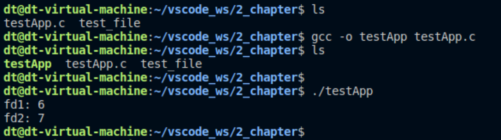

#### 示例代码 3.10.2 F_SETFL 添加 O_APPEND

```c
flag = fcntl(fd, F_GETFL);
printf("flags: 0x%x\n", flag);
fcntl(fd, F_SETFL, flag | O_APPEND);
```

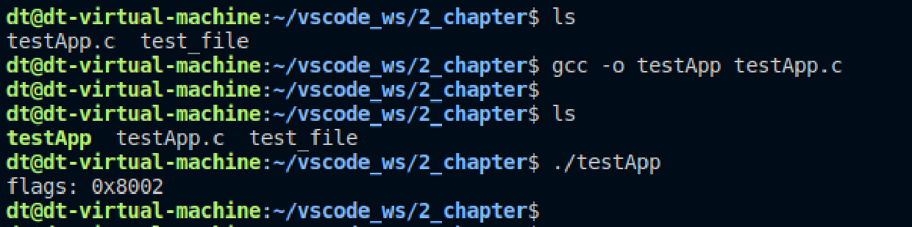

**ioctl**：设备专用控制，进阶篇再学。

---

## 3.11 截断文件 truncate / ftruncate

```c
#include <unistd.h>
#include <sys/types.h>

int truncate(const char *path, off_t length);
int ftruncate(int fd, off_t length);
```

### truncate 与 ftruncate 对比（重点）

| 对比项 | `truncate(path, length)` | `ftruncate(fd, length)` |
|--------|--------------------------|-------------------------|
| **如何指定文件** | 字符串 **路径 path** | 已打开的 **文件描述符 fd** |
| 是否需要先 `open` | **不需要** | **必须先** `open` 得到 fd |
| 写权限要求 | 对路径有写权限即可 | `open` 时需 `O_WRONLY` 或 `O_RDWR` |
| 截断语义 | **完全相同** | **完全相同** |
| 头文件 | `<unistd.h>`、`<sys/types.h>` | 同上 |

### length 参数语义

| 情况 | 结果 |
|------|------|
| `length` < 当前大小 | 截断，后面数据丢失 |
| `length` > 当前大小 | **扩展**；扩展区读为 `'\0'`（类似空洞） |
| 当前读写偏移 | **截断不改变** offset；文件变短后旧 offset 可能越界 → 需 `lseek` 重设 |

### 与 O_TRUNC、空洞文件的关系

| 手段 | 典型结果长度 |
|------|--------------|
| `open(..., O_TRUNC)` | 固定变为 **0** |
| `ftruncate(fd, 0)` | 变为 **0**（需已有 fd） |
| `truncate(path, 1024)` | 变为 **1024**（可扩展） |
| `lseek` 超 EOF 再写 | 产生**空洞**（逻辑大、物理小） |

#### 示例代码 3.11.1（教材完整）

```c
#include <stdio.h>
#include <stdlib.h>
#include <unistd.h>
#include <sys/types.h>
#include <sys/stat.h>
#include <fcntl.h>

int main(void)
{
    int fd;

    /* 打开 file1 → 用 fd 截断 */
    if (0 > (fd = open("./file1", O_RDWR))) {
        perror("open error");
        exit(-1);
    }

    /* ftruncate：通过文件描述符，截为 0 字节 */
    if (0 > ftruncate(fd, 0)) {
        perror("ftruncate error");
        exit(-1);
    }

    /* truncate：通过路径，截为 1024 字节 */
    if (0 > truncate("./file2", 1024)) {
        perror("truncate error");
        exit(-1);
    }

    close(fd);
    exit(0);
}
```

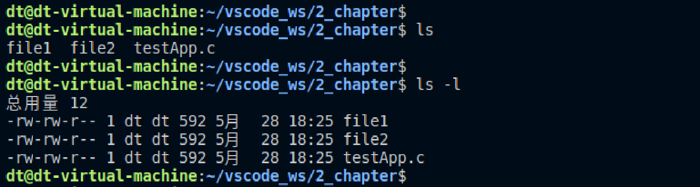  
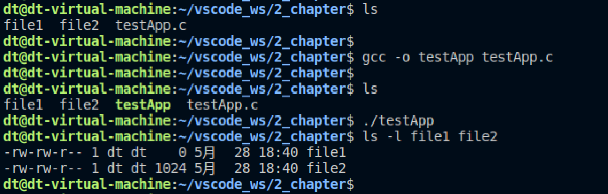

---

## 第 3 章易混点速查

| # | 易混 | 区分要点 |
|---|------|----------|
| 1 | `ls` vs `du` | 逻辑大小 vs 物理块占用 |
| 2 | `O_TRUNC` vs `truncate` | open 时清空 vs 已打开后按 length 截断 |
| 3 | `truncate` vs `ftruncate` | **path** vs **fd** |
| 4 | 多次 open vs dup | 多文件表/独立偏移 vs 共享表/共享偏移 |
| 5 | `O_APPEND` vs 手动 `lseek` 到尾 | 仅 write 强制末尾；lseek 改不了写位置 |
| 6 | `pread` vs `read+lseek` | 不改当前偏移；更原子 |
| 7 | `exit` vs `_exit` | 刷 stdio vs 不刷 |
| 8 | `strerror` vs `perror` | 返回串 vs 直接打印 |
| 9 | `dup` vs `dup2` vs `F_DUPFD` | 自动 fd / 指定 fd / 指定最小 fd |

---

## 自测清单

- [ ] 画出 fd → 文件表 → inode → block  
- [ ] 说明快速格式化为何可恢复  
- [ ] 默写 3.11.1，说清 `truncate` 与 `ftruncate` 唯一差别  
- [ ] 跑通 3.6.3 与 3.6.4，解释分别写与接续写  
- [ ] 用 dup 实现接续写，对比双 open  
- [ ] `pread` 后 `lseek(SEEK_CUR)` 为何仍为 0  

---

*配图重生成：`python scripts/extract_figures.py`*

---

# 第 4 章 标准 I/O 库 — 复习笔记

> **配图**：`../images/fig-4-x-x-x.png`

---

## 本章目录

4.1 简介 · 4.2 FILE 指针 · 4.3 标准流 · 4.4 fopen/fclose · 4.5 fread/fwrite  
4.6 fseek/ftell · 4.7 feof/ferror · 4.8 格式化 I/O · 4.9 缓冲 · 4.10 fileno/fdopen

---

## 4.1 标准 I/O 库简介

- 定义在 **`<stdio.h>`**，属于 **C 标准库**（非 Linux 独有系统调用）。
- 底层仍调用 `open/read/write/close` 等，但在用户态增加 **stdio 缓冲区**、块长度优化。
- **优势**：可移植性好、API 简单、多数顺序读写场景 **更少系统调用、更快**。

---

## 4.2 FILE 指针

| 对比项 | 文件 I/O | 标准 I/O |
|--------|----------|----------|
| 句柄类型 | `int fd` | `FILE *` |
| 结构体 | 无（内核维护表项） | `struct _IO_FILE`（含真实 fd、缓冲指针、长度、错误标志等） |
| 头文件 | `<fcntl.h>` `<unistd.h>` | `<stdio.h>` |

---

## 4.3 标准输入、标准输出、标准错误

| 流 | fd（unistd.h） | FILE*（stdio.h） | 默认设备 | 缓冲倾向 |
|----|----------------|------------------|----------|----------|
| 标准输入 | `0` `STDIN_FILENO` | `stdin` | 键盘 | 终端常**行缓冲** |
| 标准输出 | `1` `STDOUT_FILENO` | `stdout` | 终端 | 终端常**行缓冲** |
| 标准错误 | `2` `STDERR_FILENO` | `stderr` | 终端 | 常**无缓冲** |

```c
#include <unistd.h>
#define STDIN_FILENO  0
#define STDOUT_FILENO 1
#define STDERR_FILENO 2

#include <stdio.h>
extern FILE *stdin, *stdout, *stderr;
```

---

## 4.4 fopen / fclose

```c
FILE *fopen(const char *path, const char *mode);
int fclose(FILE *stream);   /* 成功 0，失败 EOF(-1) */
```

### mode 含义（表 4.4.1）

| mode | 含义 | 文件不存在 | 文件已存在 |
|------|------|------------|------------|
| `r` | 只读 | 失败 | 打开，**不截断** |
| `r+` | 读写 | 失败 | 打开，不截断 |
| `w` | 只写 | **创建** | **截断为 0** |
| `w+` | 读写 | 创建 | 截断为 0 |
| `a` | 只写追加 | 创建 | 打开，写总在**末尾** |
| `a+` | 读写追加 | 创建 | 打开，写总在末尾 |

- `fopen` **不能**像 `open` 那样传权限位；新建默认 **`0666`**（再经 **umask** 掩码）。

```c
S_IRUSR | S_IWUSR | S_IRGRP | S_IWGRP | S_IROTH | S_IWOTH  /* 0666 */
```

#### 使用示例

```c
FILE *fp = fopen("./test_file", "w+");
if (fp == NULL) {
    perror("fopen error");
    exit(-1);
}
fclose(fp);
```

---

## 4.5 fread / fwrite

```c
size_t fread(void *ptr, size_t size, size_t nmemb, FILE *stream);
size_t fwrite(const void *ptr, size_t size, size_t nmemb, FILE *stream);
```

### fread/fwrite 与 read/write 对比

| 对比项 | `read` / `write` | `fread` / `fwrite` |
|--------|------------------|---------------------|
| 数据量参数 | 一个 `count`（字节数） | `size` × `nmemb`（数据项） |
| 返回值 | **字节数**（或 -1） | **数据项个数**（除非 size=1） |
| 缓冲 | 内核缓冲 | 内核 + **stdio 缓冲** |
| 到达末尾/错误 | 返回短计数 | 返回 < nmemb → 用 `feof`/`ferror` |

```c
fwrite(&obj, sizeof(struct mystr), 1, fp);
/* 等价 */
fwrite(&obj, 1, sizeof(struct mystr), fp);
```

#### 示例代码 4.5.1 fwrite

```c
#include <stdio.h>
#include <stdlib.h>

int main(void)
{
    char buf[] = "Hello World!\n";
    FILE *fp = NULL;

    if (NULL == (fp = fopen("./test_file", "w"))) {
        perror("fopen error");
        exit(-1);
    }
    printf("文件打开成功!\n");

    if (sizeof(buf) > fwrite(buf, 1, sizeof(buf), fp)) {
        printf("fwrite error\n");
        fclose(fp);
        exit(-1);
    }
    printf("数据写入成功!\n");

    fclose(fp);
    exit(0);
}
```

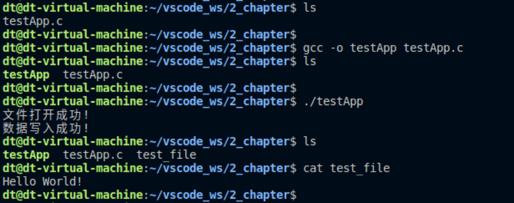

#### 示例代码 4.5.2 fread

```c
#include <stdio.h>
#include <stdlib.h>

int main(void)
{
    char buf[50] = {0};
    FILE *fp = NULL;
    int size;

    if (NULL == (fp = fopen("./test_file", "r"))) {
        perror("fopen error");
        exit(-1);
    }
    printf("文件打开成功!\n");

    if (12 > (size = fread(buf, 1, 12, fp))) {
        if (ferror(fp)) {
            printf("fread error\n");
            fclose(fp);
            exit(-1);
        }
        /* 未出错 → 已到文件末尾 */
    }
    printf("成功读取%d 个字节数据: %s\n", size, buf);

    fclose(fp);
    exit(0);
}
```

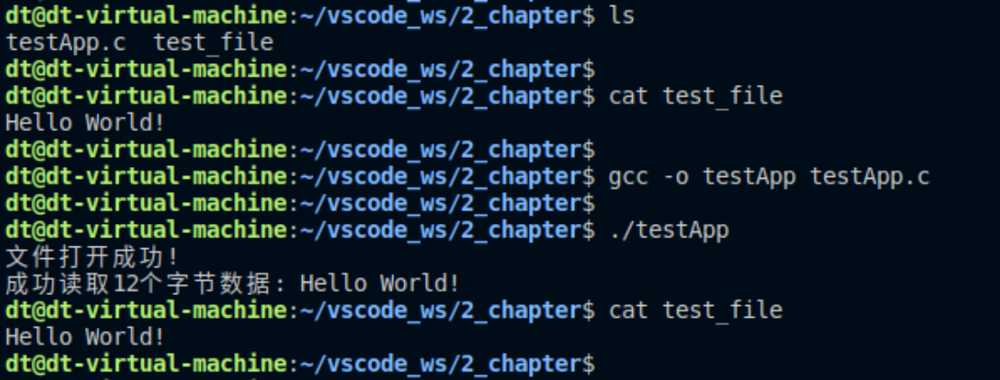

---

## 4.6 fseek / ftell

```c
int fseek(FILE *stream, long offset, int whence);
long ftell(FILE *stream);
```

### fseek 与 lseek 对比

| 对比项 | `fseek` | `lseek` |
|--------|---------|---------|
| 层次 | 标准 I/O | 系统调用 |
| 参数 | `FILE *` | `fd` |
| **成功返回值** | **0** | **新偏移量** |
| 失败 | -1 | -1 |
| whence | `SEEK_SET/SEEK_CUR/SEEK_END` | 同左 |

```c
fseek(fp, 0, SEEK_SET);
fseek(fp, 0, SEEK_END);
fseek(fp, 100, SEEK_SET);
```

#### 示例代码 4.6.1

```c
#include <stdio.h>
#include <stdlib.h>

int main(void)
{
    FILE *fp = NULL;
    char rd_buf[100] = {0};
    char wr_buf[] = "正点原子 http://www.openedv.com/forum.php\n";
    int ret;

    if (NULL == (fp = fopen("./test_file", "w+"))) {
        perror("fopen error");
        exit(-1);
    }
    printf("文件打开成功!\n");

    if (sizeof(wr_buf) > fwrite(wr_buf, 1, sizeof(wr_buf), fp)) {
        printf("fwrite error\n");
        fclose(fp);
        exit(-1);
    }
    printf("数据写入成功!\n");

    if (0 > fseek(fp, 0, SEEK_SET)) {
        perror("fseek error");
        fclose(fp);
        exit(-1);
    }

    if (sizeof(wr_buf) > (ret = fread(rd_buf, 1, sizeof(wr_buf), fp))) {
        printf("fread error\n");
        fclose(fp);
        exit(-1);
    }
    printf("成功读取%d 个字节数据: %s\n", ret, rd_buf);

    fclose(fp);
    exit(0);
}
```

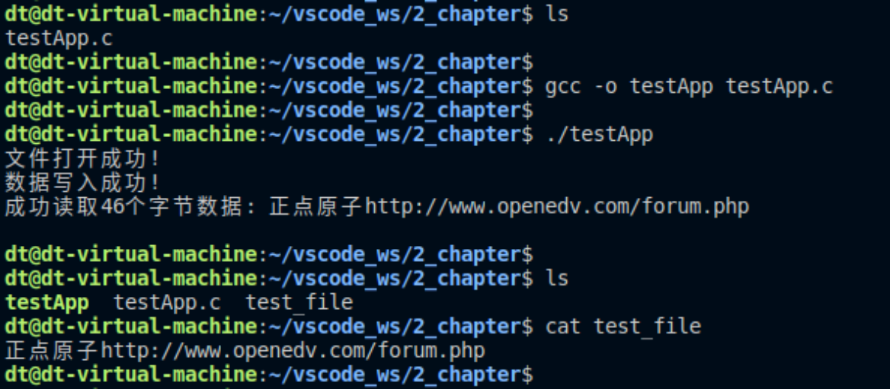

#### 示例代码 4.6.2 用 ftell 求文件大小

```c
    if (NULL == (fp = fopen("./testApp.c", "r"))) {
        perror("fopen error");
        exit(-1);
    }
    fseek(fp, 0, SEEK_END);
    ret = ftell(fp);
    printf("文件大小: %d 个字节\n", ret);
    fclose(fp);
```

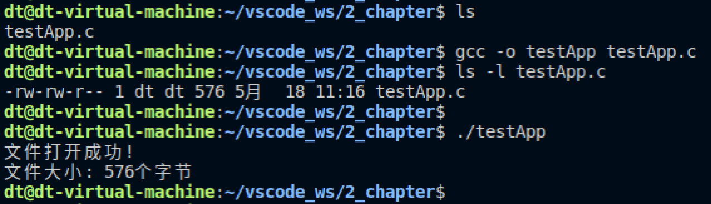

---

## 4.7 feof / ferror / clearerr

| 函数 | 检测对象 | 返回非 0 表示 |
|------|----------|---------------|
| `feof(fp)` | EOF 标志 | 已到文件尾 |
| `ferror(fp)` | 错误标志 | I/O 出错 |
| `clearerr(fp)` | 清除上述标志 | 无返回值 |

### fread 返回值不足时如何判断

| 顺序 | 做法 |
|------|------|
| 1 | `fread` 返回 < nmemb |
| 2 | 先 `ferror(fp)` → 真：错误 |
| 3 | 否则多为 **EOF**（可用 `feof` 确认） |

- **`fseek` 成功**也会清除 EOF 标志。

#### 示例代码 4.7.1

```c
#include <stdio.h>
#include <stdlib.h>

int main(void)
{
    FILE *fp = NULL;
    char buf[20] = {0};

    if (NULL == (fp = fopen("./testApp.c", "r"))) {
        perror("fopen error");
        exit(-1);
    }
    printf("文件打开成功!\n");

    if (0 > fseek(fp, 0, SEEK_END)) {
        perror("fseek error");
        fclose(fp);
        exit(-1);
    }

    if (10 > fread(buf, 1, 10, fp)) {
        if (feof(fp))
            printf("end-of-file 标志被设置,已到文件末尾!\n");
        clearerr(fp);
    }

    fclose(fp);
    exit(0);
}
```

---

## 4.8 格式化 I/O

### 输出五函数对比

| 函数 | 输出目标 |
|------|----------|
| `printf` | 标准输出 |
| `fprintf` | 指定 `FILE *` |
| `dprintf` | 指定 **fd** |
| `sprintf` | 用户缓冲区（有溢出风险） |
| `snprintf` | 用户缓冲区 + **长度限制**（推荐） |

### 输入三函数

`scanf` / `fscanf` / `sscanf` —— 格式串：`%[flags][width][.precision][length]type`

| 特性 | 说明 |
|------|------|
| `%*` | 读入但不存储 |
| `%ms` 等 `%m` | 库内 malloc，用完 **free** |
| width | 最大字段宽（如 `%4s`） |

格式表详见教材表 4.8.1~4.8.7。

#### 示例代码 4.8.1

```c
#include <stdio.h>
#include <stdlib.h>
#include <unistd.h>
#include <string.h>

int main(void)
{
    char buf[50] = {0};

    printf("%d (%s) %d (%s)\n", 520, "我爱你", 1314, "一生一世");
    fprintf(stdout, "%d (%s) %d (%s)\n", 520, "我爱你", 1314, "一生一世");
    dprintf(STDOUT_FILENO, "%d (%s) %d (%s)\n", 520, "我爱你", 1314, "一生一世");

    sprintf(buf, "%d (%s) %d (%s)\n", 520, "我爱你", 1314, "一生一世");
    printf("%s", buf);

    memset(buf, 0x00, sizeof(buf));
    snprintf(buf, sizeof(buf), "%d (%s) %d (%s)\n", 520, "我爱你", 1314, "一生一世");
    printf("%s", buf);

    exit(0);
}
```

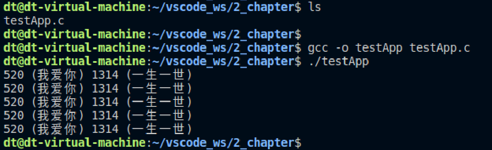

#### 示例代码 4.8.2 scanf（%ms 需 free）

```c
    scanf("%d", &a);
    scanf("%f", &b);
    scanf("%ms", &str);   /* 库分配内存 */
    printf("你输入的字符串为: %s\n", str);
    free(str);
```

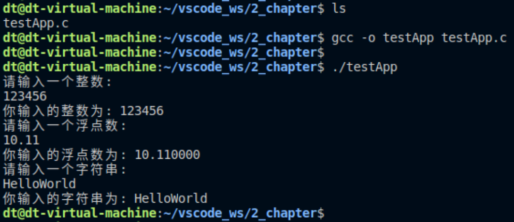

---

## 4.9 I/O 缓冲（全章重点）

### 4.9.1 内核缓冲与刷盘

`read/write` 先与 **内核 Page Cache** 交换，落盘由内核异步完成。

#### fsync / fdatasync / sync 对比

| 函数 | 范围 | 刷什么 | 何时返回（Linux） |
|------|------|--------|-------------------|
| `fsync(fd)` | 单文件 | **数据 + 元数据** | 该文件落盘完成后 |
| `fdatasync(fd)` | 单文件 | **仅数据** | 数据落盘完成后 |
| `sync()` | **全局** | 所有脏页 | 通常等写完才返回 |

#### open 同步标志

| 标志 | 近似效果 |
|------|----------|
| `O_SYNC` | 每次 `write` 后类似 `fsync` |
| `O_DSYNC` | 每次 `write` 后类似 `fdatasync` |

**U 盘**：拷贝后执行 `sync`，否则可能丢数据。

#### 示例代码 4.9.1 文件拷贝 + fsync

```c
#include <stdio.h>
#include <stdlib.h>
#include <sys/types.h>
#include <sys/stat.h>
#include <fcntl.h>
#include <unistd.h>

#define BUF_SIZE 4096
#define READ_FILE "./rfile"
#define WRITE_FILE "./wfile"

static char buf[BUF_SIZE];

int main(void)
{
    int rfd, wfd;
    size_t size;

    rfd = open(READ_FILE, O_RDONLY);
    wfd = open(WRITE_FILE, O_WRONLY | O_CREAT | O_TRUNC, 0664);

    while (0 < (size = read(rfd, buf, BUF_SIZE)))
        write(wfd, buf, size);

    fsync(wfd);   /* 确保目标文件落盘 */

    close(rfd);
    close(wfd);
    exit(0);
}
```

### 4.9.2 直接 I/O（O_DIRECT）

- `#define _GNU_SOURCE` 后 `open(..., O_DIRECT)`。
- **三条对齐**：缓冲区地址、文件偏移、读写长度均为 **块大小（常 4096）** 整数倍。

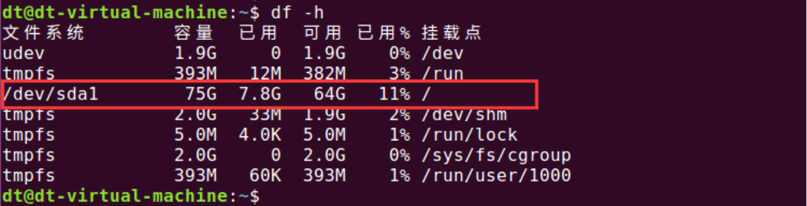  
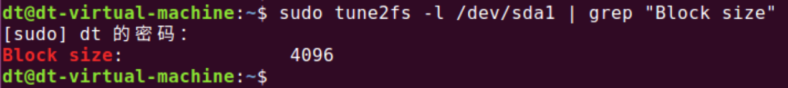

#### 示例代码 4.9.2 直接 I/O（节选）

```c
#define _GNU_SOURCE
#include <fcntl.h>
#include <unistd.h>
/* 缓冲区需 __attribute__((aligned(4096))) */
fd = open("./test_file", O_WRONLY | O_CREAT | O_TRUNC | O_DIRECT, 0664);
while (count--)
    write(fd, buf, 4096);   /* 每次必须 4096 字节 */
```

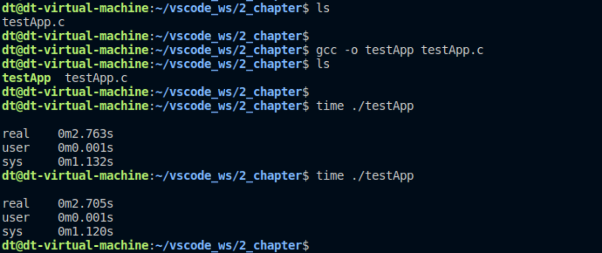  
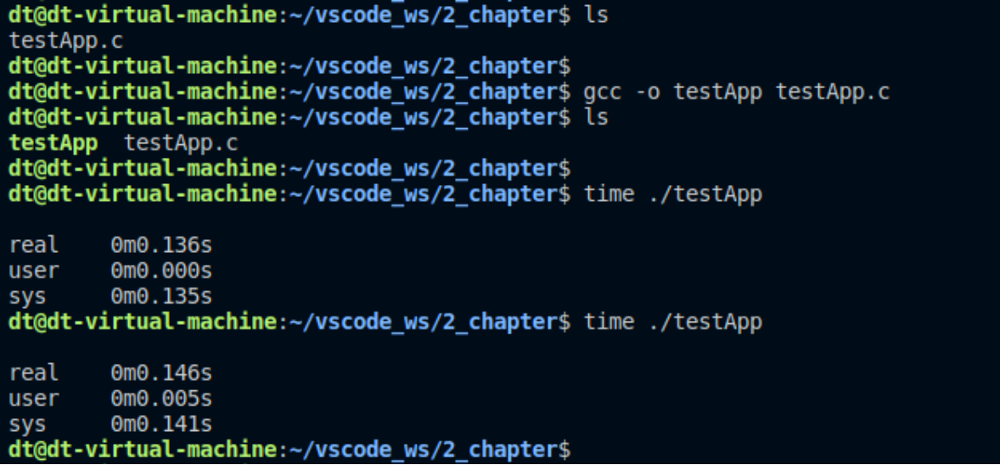

### 4.9.3 stdio 缓冲

```c
int setvbuf(FILE *stream, char *buf, int mode, size_t size);
```

#### 三种 stdio 缓冲模式

| mode | 名称 | 行为 |
|------|------|------|
| `_IONBF` | 无缓冲 | 每次 I/O 立刻进内核（**stderr** 默认） |
| `_IOLBF` | 行缓冲 | 遇 `\n` 刷（**终端 stdout** 默认） |
| `_IOFBF` | 全缓冲 | 缓冲满才 `write`（**磁盘文件** 默认） |

#### setvbuf / setbuf / setbuffer 对比

| 函数 | 指定缓冲大小 | 返回值 |
|------|:------------:|--------|
| `setvbuf` | **是**（参数 size） | 成功 0 |
| `setbuf` | 固定 `BUFSIZ` | void |
| `setbuffer` | **是** | void |

#### 刷新 stdio 的方式对比

| 方式 | 是否刷 stdio → 内核 |
|------|:-------------------:|
| `fflush(stream)` | **是** |
| `fclose` | **是** |
| `exit()` / `return` 正常结束 | **是** |
| `_exit()` | **否** |

#### 示例代码 4.9.4 行缓冲

```c
#include <stdio.h>
#include <stdlib.h>
#include <unistd.h>

int main(void)
{
    printf("Hello World!\n");
    printf("Hello World!");
    for (;;)
        sleep(1);
}
```

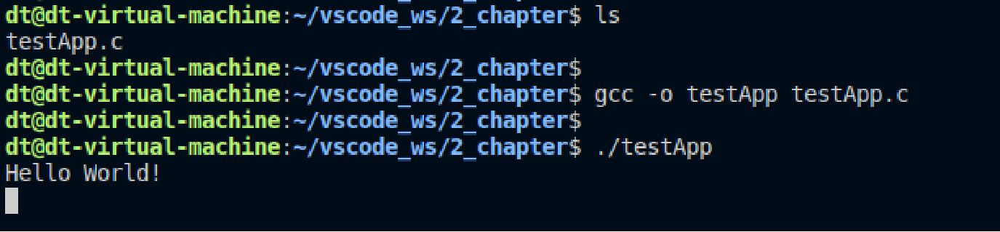

#### 示例代码 4.9.5 无缓冲

```c
    setvbuf(stdout, NULL, _IONBF, 0);
    printf("Hello World!\n");
    printf("Hello World!");
```

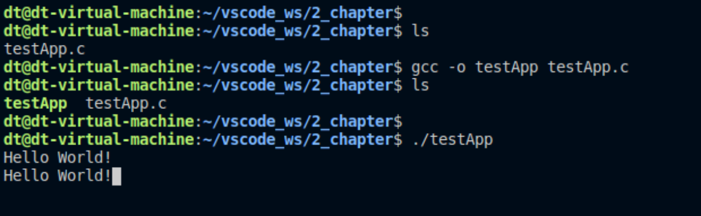

#### 示例代码 4.9.6 fflush

```c
    printf("Hello World!\n");
    printf("Hello World!");
    fflush(stdout);
```

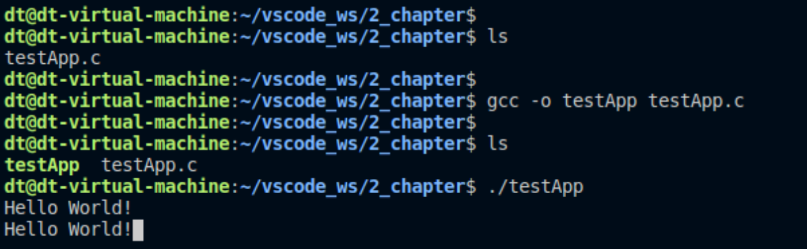

#### 示例代码 4.9.8 程序退出自动刷

```c
    printf("Hello World!\n");
    printf("Hello World!");
    /* 无 fflush，直接结束 → 两句都会显示 */
```

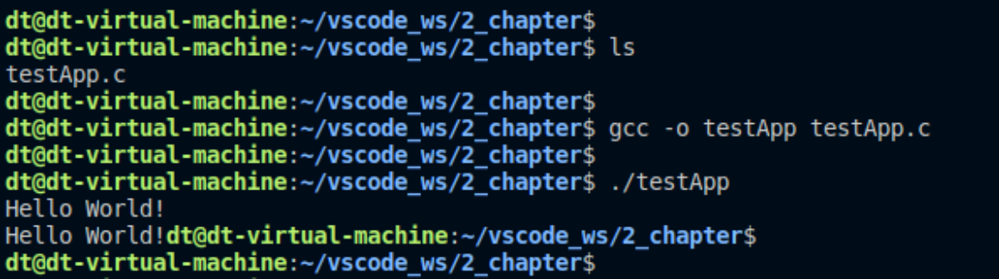

### 两层缓冲总图

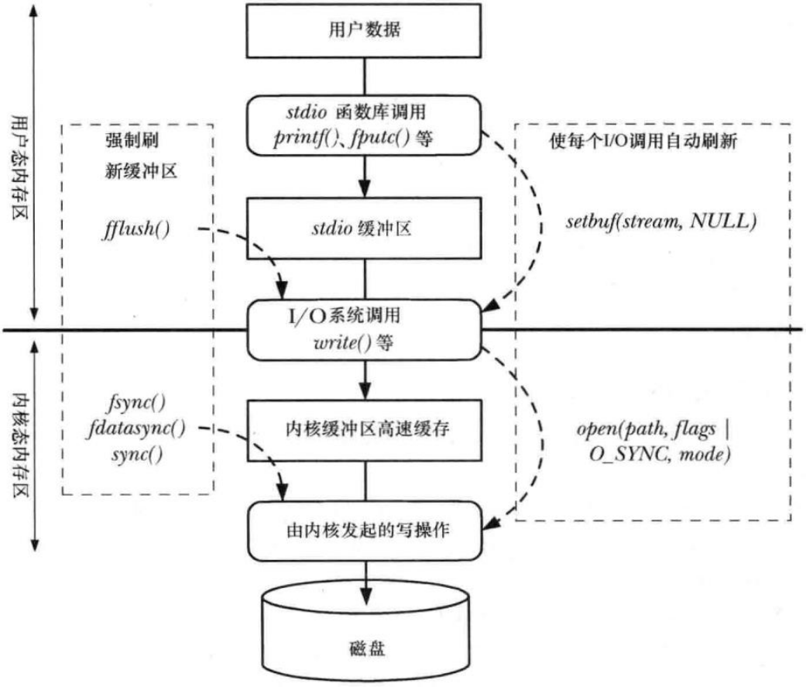

```
应用 → stdio 缓冲 → read/write → 内核缓冲 → 磁盘
         fflush              fsync/sync
```

---

## 4.10 文件描述符与 FILE 指针互转

```c
int fileno(FILE *stream);              /* FILE* → fd */
FILE *fdopen(int fd, const char *mode); /* fd → FILE*，mode 须与 open 方式一致 */
```

### 混合 I/O 注意

| 调用 | 走的缓冲 |
|------|----------|
| `printf` | stdio 缓冲 |
| `write(STDOUT_FILENO,...)` | **直接内核** |

#### 教材示例（先 write 后 print）

```c
#include <stdio.h>
#include <stdlib.h>
#include <unistd.h>

int main(void)
{
    printf("print");
    write(STDOUT_FILENO, "write\n", 6);
    exit(0);
}
```

→ 常先看到 `write`，后看到 `print`；解决：`fflush(stdout)` 或统一用一种 I/O。

---

## 第 4 章易混点速查

| # | 易混 | 区分要点 |
|---|------|----------|
| 1 | `fread` 返回值 | **数据项个数**，不是字节数 |
| 2 | `fseek` vs `lseek` 成功返回 | **0** vs **新偏移** |
| 3 | `feof` vs `ferror` | 到末尾 vs 出错；先 `ferror` |
| 4 | `fsync` vs `fdatasync` | 数据+元数据 vs 仅数据 |
| 5 | `fflush` vs `fsync` | 只刷 stdio；落盘还要内核刷 |
| 6 | 行缓冲 vs 全缓冲 | 终端 `\n` vs 磁盘写满 |
| 7 | `sprintf` vs `snprintf` | 后者限长防溢出 |
| 8 | `exit` vs `_exit` 与 stdio | 前者刷缓冲，后者不刷 |
| 9 | `fileno` + `write` 混 `printf` | 双层缓冲顺序乱 |

---

## 自测清单

- [ ] 背诵六种 `fopen` mode 行为差异  
- [ ] 写 `fread` 分支：`ferror` / `feof`  
- [ ] `fseek`+`ftell` 求文件大小  
- [ ] 解释 4.9.5 第二个 printf 不显示  
- [ ] 列出 `fsync`/`fdatasync`/`sync` 区别  
- [ ] O_DIRECT 三条对齐  
- [ ] 运行 printf+write 实验并 `fflush` 修复  

---


---

| # | 易混概念 | 区分要点 | 见章节 |
|---|----------|----------|--------|
| 1 | 系统调用 vs 库函数 | 内核 API vs glibc；`man 2` vs `man 3` | 1.2 / 4.1 |
| 2 | 文件 I/O vs 标准 I/O | `int fd` vs `FILE*`；无 stdio 缓冲 vs 有 | 2 / 4 |
| 3 | `read`/`write` vs `fread`/`fwrite` | 返回字节数 vs 返回**数据项个数** | 2.4~2.5 / 4.5 |
| 4 | `lseek` vs `fseek` | 成功返回**偏移量** vs 成功返回 **0** | 2.7 / 4.6 |
| 5 | `open` flags vs `fopen` mode | 位标志 + mode 权限 vs 字符串 mode | 2.3 / 4.4 |
| 6 | `O_TRUNC` vs `truncate` | open 时清空 vs 已打开后按 length 截断 | 2.3 / 3.5 / 3.11 |
| 7 | `truncate` vs `ftruncate` | **path** vs **fd** | 3.11 |
| 8 | 多次 open vs dup | 独立偏移 vs 共享偏移 | 3.6 / 3.7 |
| 9 | `O_APPEND` vs 手动 lseek 到尾 | 只强制 write 在末尾 | 3.5 |
| 10 | `fflush` vs `fsync` | 只刷 stdio 到内核 vs 落盘 | 4.9 |
| 11 | `exit` vs `_exit` | 刷 stdio 缓冲 vs 不刷 | 3.3 / 4.9 |
| 12 | fd 0/1/2 vs stdin/stdout/stderr | 同一流的两套句柄 | 2.2 / 4.3 |
| 13 | `ls` vs `du`（空洞文件） | 逻辑大小 vs 物理块占用 | 3.4 |
| 14 | `printf` + `write(1,...)` 混用 | 双层缓冲导致输出顺序乱 | 4.10 |

---

## 全书自测清单

### 第 1 章
- [ ] 画出应用 → 系统调用 → 内核关系
- [ ] 对比裸机/驱动/应用三层 LED 示例
- [ ] 说出系统调用与库函数 4 条区别
- [ ] 查看本机 glibc 版本

### 第 2 章
- [ ] 解释 fd 为何常从 3 开始
- [ ] 默写 open 常用 flags 与 mode 宏
- [ ] 独立完成 2.8 四个练习
- [ ] 用 lseek 求文件大小

### 第 3 章
- [ ] 画出 fd → 文件表 → inode → block
- [ ] 说明快速格式化为何可恢复
- [ ] 跑通 3.6.3 与 3.6.4，解释分别写与接续写
- [ ] 说清 `truncate` 与 `ftruncate` 唯一差别

### 第 4 章
- [ ] 背诵六种 `fopen` mode
- [ ] 写 `fread` 分支：`ferror` / `feof`
- [ ] 解释行缓冲下第二个 printf 不显示
- [ ] 列出 `fsync` / `fdatasync` / `sync` 区别

---

*配图重生成：第 1~2 章 `python scripts/extract_figures_ch12.py`；第 3~4 章 `python scripts/extract_figures.py`*
